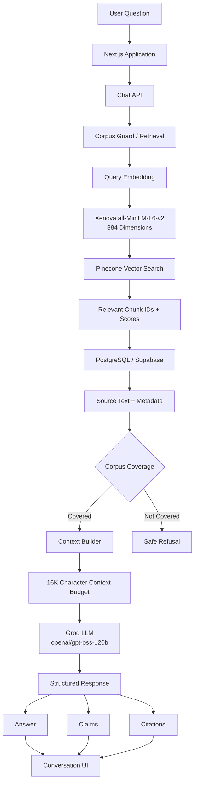

# Nutrition Intelligence

> Evidence-backed nutrition answers grounded in official dietary guidance.

**Live Application:** https://nutritionintelligence.vercel.app

**Current Release:** `v1.0.0-mvp-production`

---

## Overview

Nutrition Intelligence is an evidence-backed nutrition and food-safety assistant built using Retrieval-Augmented Generation (RAG).

Instead of allowing a language model to answer nutrition questions entirely from its general training knowledge, the application retrieves relevant evidence from a curated corpus of official public dietary guidance and food-safety documents.

The retrieved evidence is then provided to the language model as context for generating the answer.

The system is designed around a simple principle:

> **If the available evidence does not support the question, the system should not invent an answer.**

Supported questions receive grounded responses with source citations.

Questions outside the available evidence corpus are rejected by the corpus guard.

---

## Live Demo

🌐 **Production Application**

https://nutritionintelligence.vercel.app

The production application is deployed on Vercel and uses:

- Next.js
- Groq
- Pinecone
- PostgreSQL / Supabase
- Supabase Supavisor
- Local embedding generation
- A curated dietary-guidance corpus

---

# Problem

General-purpose AI assistants can provide nutrition information, but users may not know:

- where an answer came from;
- whether the information reflects official dietary guidance;
- whether the model generated unsupported claims;
- whether a response is grounded in an authoritative source.

Nutrition Intelligence explores a different approach.

The application retrieves evidence from a defined corpus of official dietary guidance before generating an answer.

This creates a bounded system in which:

1. Questions are evaluated against the available corpus.
2. Relevant evidence is retrieved.
3. Retrieved evidence is supplied to the LLM.
4. Claims are associated with their supporting sources.
5. Unsupported questions are rejected.

---

# Key Features

- Retrieval-Augmented Generation (RAG)
- Official dietary guidance corpus
- Semantic vector search
- 384-dimensional local embeddings
- Pinecone vector database
- PostgreSQL evidence storage
- Supabase Supavisor database connectivity
- Corpus relevance guard
- Context-budget protection
- Structured LLM responses
- Claim-level source citations
- Source provenance
- Out-of-corpus refusal
- Production deployment on Vercel
- Production smoke-test validation

---

# System Architecture

