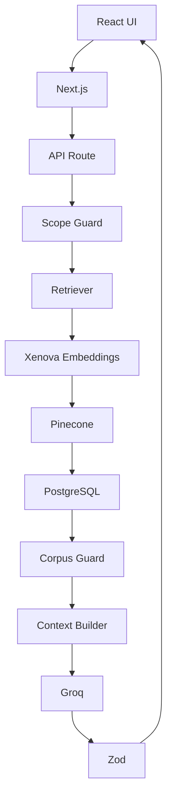
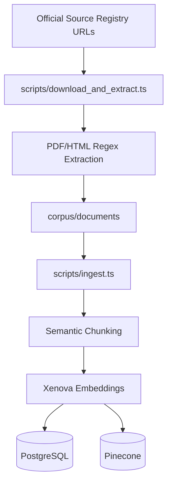
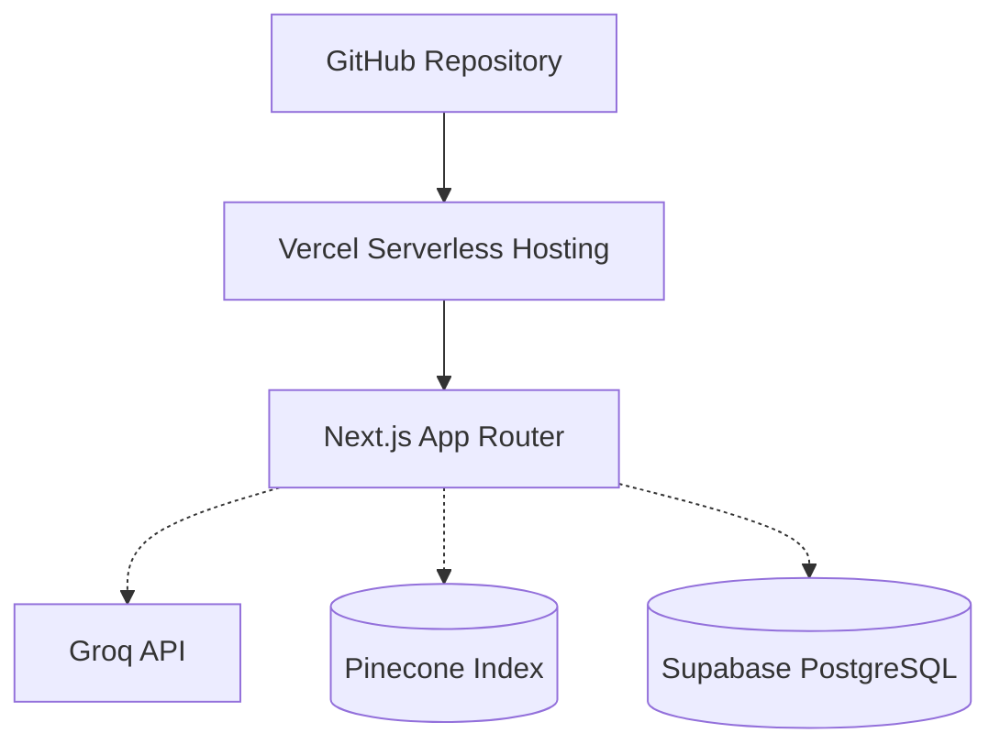

# Nutrition Intelligence

> Evidence-backed nutrition answers grounded in official dietary guidance.


**Production URL**: https://nutritionintelligence.vercel.app  
**GitHub**: https://github.com/imnashraf/Nutrition-Intelligence  
**Release**: v1.0.0-mvp-production

## At a Glance

| Item | Value |
|---|---|
| **Status** | Production MVP |
| **Release** | v1.0.0-mvp-production |
| **Framework** | Next.js 16 |
| **Language** | TypeScript |
| **LLM Provider** | Groq |
| **LLM Model** | `openai/gpt-oss-120b` |
| **Embeddings** | `Xenova/all-MiniLM-L6-v2` |
| **Vector Dimension** | 384 |
| **Vector Database** | Pinecone |
| **Database** | PostgreSQL / Supabase |
| **Deployment** | Vercel |
| **Corpus Documents** | 22 |
| **Retrieval Chunks** | 427 |
| **Pinecone Vectors** | 427 |

## Overview

Nutrition Intelligence is a bounded Retrieval-Augmented Generation (RAG) system dedicated exclusively to answering nutrition and food-safety questions. 

It retrieves evidence from a curated, closed corpus of official public dietary guidance *before* generating an answer. The application is intentionally not a general-purpose chatbot. If the available evidence does not support the question, the system will actively decline the request rather than generate an unsupported answer.

## What Problem Does It Solve?

Unrestricted Large Language Models (LLMs) pose significant risks in the health and nutrition space due to:
*   Unclear provenance of information
*   Generation of plausible but unsupported claims
*   Over-reliance on broad, generalized model knowledge rather than specific guidance
*   Difficulty determining whether a health claim comes from official guidance or internet consensus

Nutrition Intelligence enforces an **evidence-first approach**. It is designed to ground generated answers in retrieved evidence. It provides retrieved context to the LLM and maps generated claims to source metadata through structured output.

## Core Principle

> Ground the answer in retrieved evidence. If the evidence corpus does not support the question, do not invent the evidence.

This principle is technically implemented through:
*   **Scope Guard**: Pre-filtering forbidden medical and weight-loss queries.
*   **Corpus Guard**: Enforcing strict mathematical similarity thresholds on retrieved evidence.
*   **Semantic Retrieval**: Finding conceptually matching text chunks.
*   **Evidence Context**: Forcing the LLM to read only the retrieved context.
*   **Structured Output**: Forcing the LLM to map claims to citations via JSON Schema.
*   **Safe Refusal**: Bypassing the LLM entirely when evidence is insufficient.

## Technology Stack

| Layer | Technology | Purpose |
|---|---|---|
| **UI** | React | Interactive user interface |
| **Framework** | Next.js 16 App Router | Full-stack application framework |
| **Language** | TypeScript | Application and API development |
| **API** | Next.js App Router API | Serverless Chat request processing |
| **LLM Provider** | Groq | LLM inference |
| **LLM Access** | OpenAI Node.js SDK | Groq-compatible API interface |
| **LLM Model** | `openai/gpt-oss-120b` | Structured answer generation |
| **Embedding Library** | `@xenova/transformers` | Local embedding generation |
| **Embedding Model** | `Xenova/all-MiniLM-L6-v2` | Semantic embeddings |
| **Embedding Dimension** | 384 | Vector size |
| **Vector Database** | Pinecone | Semantic vector search |
| **Relational Database** | PostgreSQL | Evidence and conversation persistence |
| **Database Platform** | Supabase | Managed PostgreSQL |
| **Database Driver** | `pg` / `node-postgres` | PostgreSQL connection pooling |
| **Validation** | Zod | Strict structured response validation |
| **RAG** | Custom Retriever + Guards | Evidence retrieval, deduplication, and grounding |
| **Deployment** | Vercel | Production hosting |
| **Source Control** | Git / GitHub | Version control |
| **Ingestion** | `pdf-parse` / DOM regex | Source document ingestion scripts |

## Technology Architecture



## System Architecture

```mermaid
flowchart TD
    subgraph Frontend [Client Browser]
        HomeScreen
        ConversationScreen
        Composer
        AnswerView
        SourcePanel
    end

    subgraph Backend [Vercel Serverless]
        ClientAdapter[lib/nutrition-intelligence/client.ts]
        API[/api/chat]
        ScopeGuard[lib/scopeGuard.ts]
        CorpusGuard[lib/corpusGuard.ts]
        ContextBuilder[16K Context Builder]
        Zod[Zod Validation]
    end

    subgraph Embedding [Local Compute]
        Xenova[Xenova/all-MiniLM-L6-v2]
    end

    subgraph Infrastructure [External Services]
        Pinecone[(Pinecone Vector DB)]
        PostgreSQL[(Supabase PostgreSQL)]
        Groq[Groq Inference Engine]
    end

    Composer --> ClientAdapter
    ClientAdapter --> API
    API --> ScopeGuard
    ScopeGuard --> PostgreSQL
    ScopeGuard --> Xenova
    Xenova --> Pinecone
    Pinecone --> PostgreSQL
    PostgreSQL --> CorpusGuard
    CorpusGuard --> ContextBuilder
    ContextBuilder --> Groq
    Groq --> Zod
    Zod --> PostgreSQL
    PostgreSQL --> ScopeGuard
    ScopeGuard --> AnswerView
    AnswerView --> SourcePanel
```

## User Question Flow

### Step 1 — User submits question
The user inputs a question via the `Composer` component on the `HomeScreen` or `ConversationScreen`.

### Step 2 — Client adapter
`lib/nutrition-intelligence/client.ts` intercepts the submission and sends a POST request to the backend API.

### Step 3 — API
`app/api/chat/route.ts` receives the incoming request and generates a conversation ID if necessary.

### Step 4 — Scope Guard
The system runs a pre-check (`lib/scopeGuard.ts`) using regex to prevent forbidden medical advice, medication queries, or weight-loss topics (e.g., "how many calories to lose weight").

### Step 5 — Conversation persistence
The user's message is immediately saved to the `messages` table in PostgreSQL.

### Step 6 — Query embedding
The `Xenova/all-MiniLM-L6-v2` model natively generates a 384-dimensional vector embedding of the user's question without hitting an external API.

### Step 7 — Pinecone
A semantic similarity search is executed against the Pinecone index to find the most conceptually relevant document chunks. 

### Step 8 — PostgreSQL evidence retrieval
The unique chunk IDs returned by Pinecone are used to query the `chunks` and `documents` tables in PostgreSQL, retrieving the full-text content and publisher metadata.

### Step 9 — Corpus Guard
The relevance logic (`lib/corpusGuard.ts`) evaluates the similarity scores of the retrieved chunks. The Pinecone retriever initially filters out any chunks below `0.45`. The guard strictly requires:
- At least two chunks with a score `> 0.55` 
**OR**
- A top chunk `> 0.50` AND a secondary chunk `> 0.45`

### Step 10 — Context Builder
The retrieved text is assembled into a single string. Chunks are preserved whole, with a strict maximum limit of 16,000 characters.

### Step 11 — Groq
The context and conversation history are sent to the `openai/gpt-oss-120b` model hosted on Groq via the OpenAI Node.js SDK.

### Step 12 — Structured response
The API forces a strict `json_schema` response format from the model, mapping out the answer and its exact source citations.

### Step 13 — Zod
The returned string is parsed and validated against `ChatResponseSchema` to ensure strict type compliance.

### Step 14 — Persistence
The generated assistant response and associated JSON claims are saved to PostgreSQL.

### Step 15 — Post-generation Scope Guard
A final safety check scans the generated answer to ensure the LLM did not slip into forbidden topics.

### Step 16 — Frontend
The `AnswerView` component displays the formatted markdown, and the `SourcePanel` dynamically maps the citation objects `[1]` to the interactive slide-over UI.

## RAG Ingestion Pipeline



## Scope Guard vs Corpus Guard

The application uses guards to constrain scope and evidence coverage.

### Scope Guard
*   **Purpose**: Actively prevent users from soliciting unsupported medical, diagnostic, or weight-loss advice.
*   **Location**: `lib/scopeGuard.ts`
*   **Execution**: Runs *before* the database is queried, and again *after* the LLM generates a response. 

### Corpus Guard
*   **Purpose**: Determine whether the officially retrieved evidence sufficiently covers the user's question, preventing the LLM from fabricating answers to niche topics.
*   **Location**: `lib/corpusGuard.ts`
*   **Execution**: Runs *after* chunks are retrieved from Pinecone. If similarity scores fall below the required thresholds (`0.50`/`0.55`), the guard returns an explicit refusal, entirely bypassing the LLM.

## RAG Retrieval

1.  **Query Embedding**: User text is converted to a 384d vector.
2.  **Pinecone Query**: Searches the vector space.
3.  **Similarity Scores**: Filters out any vector below `0.45` relevance.
4.  **TopK Initial**: Fetches up to `topK * 3` chunks (default 24).
5.  **Deduplication**: Iterates through vectors and enforces a maximum of *two chunks per document* to ensure evidence diversity.
6.  **TopK Final**: Returns the absolute top 8 most diverse and relevant chunks.
7.  **PostgreSQL Retrieval**: Fetches the exact text mapping to the final chunk IDs.

## Context Building

*   Retrieved chunks are formatted sequentially (`--- Chunk N ---`).
*   The system enforces a hard limit of **16,000 characters** (approx. 4,000 tokens).
*   Chunks are never truncated; they are preserved whole. 
*   If appending the next retrieved chunk exceeds the 16K limit, that chunk is skipped to maintain context integrity.

## Structured Output

The model is constrained to return a strict JSON Schema output. Zod subsequently validates the parsed response.

*   `answer`: The narrative Markdown response.
*   `claims[]`: An array of specific facts generated in the answer.

Each claim includes:
*   `claim`: The factual statement.
*   `documentTitle`
*   `publisher`
*   `year`
*   `url`
*   `sectionHeading`
*   `snippet`: The exact text snippet from the document proving the claim.

## Evidence Corpus

Derived from `corpus/registry.json`:

| # | Document | Publisher | Year | Category |
|---|---|---|---|---|
| 1 | Dietary Guidelines for Americans 2020-2025 | USDA/HHS | 2020 | nutrition |
| 2 | WHO Five Keys to Safer Food Manual | WHO | 2006 | food_safety |
| 3 | FDA Safe Food Handling Guide | FDA | 2023 | food_safety |
| 4 | The Eatwell Guide | Public Health England | 2016 | nutrition |
| 5 | Australian Dietary Guidelines | NHMRC | 2013 | nutrition |
| 6 | Canada's Food Guide | Health Canada | 2019 | nutrition |
| 7 | EFSA Dietary Reference Values | EFSA | 2017 | nutrition |
| 8 | WHO Healthy Diet Fact Sheet | WHO | 2020 | nutrition |
| 9 | CDC Food Safety Resources | CDC | 2023 | food_safety |
| 10 | USDA Safe Minimum Internal Temperature Chart | USDA | 2020 | cooking |
| 11 | New Zealand Eating and Activity Guidelines | Ministry of Health NZ | 2020 | nutrition |
| 12 | FAO Food-Based Dietary Guidelines Database | FAO | 2023 | nutrition |
| 13 | U.S. FoodSafety.gov - Cold Food Storage Chart | HHS | 2023 | food_safety |
| 14 | Irish Food Safety Authority - Safe Food To Go | FSAI | 2021 | food_safety |
| 15 | Japan Food Guide Spinning Top | MHLW | 2005 | nutrition |
| 16 | Dietary Guidelines for Indians | NIN | 2011 | nutrition |
| 17 | Dietary Guidelines for the Brazilian Population | Ministry of Health Brazil | 2014 | nutrition |
| 18 | Nordic Nutrition Recommendations (NNR) | Nordic Council of Ministers | 2023 | nutrition |
| 19 | Singapore Health Promotion Board - My Healthy Plate | HPB | 2020 | nutrition |
| 20 | USDA FSIS - Leftovers and Food Safety | USDA | 2020 | food_safety |
| 21 | FDA - Food Safety in Your Kitchen | FDA | 2023 | food_safety |
| 22 | Safe preparation, storage and handling of powdered infant formula | WHO | 2007 | food_safety |

## Corpus Statistics

*   **22** documents
*   **427** chunks
*   **427** vectors
*   **384** dimensions

## Project Structure

*   `app/api/chat/route.ts`: Central orchestration API route for the RAG pipeline.
*   `app/(nutrition-intelligence)/page.tsx`: Next.js frontend route for the chat interface.
*   `components/nutrition-intelligence/`: Shared React UI components.
*   `lib/nutrition-intelligence/client.ts`: Frontend data adapter mapping API payloads to UI schemas.
*   `lib/nutrition-intelligence/actions.ts`: Server actions for fetching historical conversations directly from PostgreSQL.
*   `lib/openai.ts`: Manages Groq LLM invocation, context assembly, and Zod validation.
*   `lib/retriever.ts`: Queries Pinecone vectors and fetches full-text from Postgres.
*   `lib/embeddings.ts`: Utilizes local Xenova MiniLM models to generate 384d embeddings.
*   `lib/corpusGuard.ts`: Enforces score thresholds for evidence coverage.
*   `lib/scopeGuard.ts`: Regex-based firewall blocking medical and weight-loss queries.
*   `lib/schema.ts`: Zod schema definitions for the JSON structured output.
*   `lib/db.ts`: PostgreSQL `pg` client wrapper and connection pool.
*   `scripts/download_and_extract.ts`: Ingestion script downloading official PDFs/HTML and extracting raw text.
*   `scripts/ingest.ts`: Script to chunk text, generate embeddings, and populate PostgreSQL and Pinecone.

## Production Architecture

*   **Vercel**: Hosts the Next.js frontend and Serverless API functions.
*   **Next.js**: Provides the full-stack routing and server-side execution framework.
*   **Groq**: Provides inference for the `120b` open-source LLM.
*   **Pinecone**: Provides semantic similarity matching for vector embeddings.
*   **Supabase PostgreSQL**: Hosts the relational data, utilizing Supavisor for robust connection pooling to prevent serverless connection exhaustion.

## Production Validation

The system successfully passes its core production acceptance criteria:
*   **Chicken protein**: Accurately retrieves FDA/USDA guidelines and returns a successfully formatted claim with citations.
*   **Healthy diet**: Synthesizes cross-document evidence from WHO, Canada, and the UK guidelines.
*   **WHO Five Keys**: Accurately retrieves the 5 key safety principles directly from the WHO manual.
*   **Capital of France**: Correctly intercepted by the `corpusGuard` and actively refused, proving the system is bounded and not acting as a general-knowledge chatbot.

## Retrieval Quality Case Study

During development, retrieving the "WHO Five Keys" returned an initial similarity score of `≈ 0.4506` (dangerously close to the `0.45` rejection threshold).

**The Engineering Lesson**: The root cause was that the wrong WHO source had originally been ingested. The source file did not contain the actual Five Keys manual content; the Five Keys reference appeared only in supporting/bibliographic content. We replaced it with the correct official WHO Five Keys to Safer Food Manual, after which retrieval improved from approximately 0.4506 to 0.5809. Corpus quality and provenance are fundamental prerequisites for reliable RAG performance.

## Database Architecture

The relational database is hosted on Supabase (PostgreSQL). The application accesses it via the standard `pg` (node-postgres) driver. A connection `Pool` is instantiated within the server runtime, ensuring that the high volume of serverless API requests reuse database connections via Supavisor rather than exhausting the PostgreSQL instance.

## Vector Database

Pinecone stores **384-dimensional vectors** generated locally by the Next.js server. Each vector correlates to a chunk ID, allowing the system to perform high-speed semantic similarity queries and retrieve highly targeted document context without storing the heavy text payloads inside the vector index.

## Environment Variables

*   `GROQ_API_KEY`
*   `PINECONE_API_KEY`
*   `PINECONE_INDEX`
*   `DATABASE_URL`

*(Note: Production values and Vercel OIDC tokens are strictly isolated from the repository).*

## Local Development

```bash
npm install
npm run dev
npm run build
```

## Deployment



## Security

*   Secrets are managed securely via Vercel Environment Variables.
*   No database credentials, API keys, or OIDC tokens are committed to the repository.
*   The system utilizes a strictly **bounded evidence corpus**, severely limiting the LLM's surface area for generating malicious or dangerous responses.
*   The **Scope Guard** actively prevents the parsing of high-risk medical or diagnostic queries.
*   The **Corpus Guard** restricts the LLM from attempting to answer general-knowledge questions outside the provided context.

## Limitations

*   The system is strictly bounded by its current 22-document corpus.
*   Out-of-corpus questions will be actively refused.
*   Retrieval quality is highly dependent on the quality and format of the source text extraction.
*   Official dietary guidance evolves; the corpus requires manual audits and ingestion updates.
*   While citations ensure provenance, they do not guarantee the LLM hasn't misinterpreted the text snippet contextually.
*   **This is not a general-purpose chatbot.**
*   **This is not a replacement for professional medical advice.**

## Design Philosophy

*   **Evidence** over unrestricted generation
*   **Bounded** over open-ended
*   **Refusal** over fabrication
*   **Provenance** over anonymous knowledge
*   **Production engineering** over demo-only behavior

## Roadmap

*Future considerations for scaling the platform:*
*   Expansion to a larger corpus of global guidelines.
*   Automated retrieval evaluation and regression testing.
*   Document freshness monitoring for source URLs.
*   Improved mobile UX for the interactive Source Panel.
*   Multilingual support for non-English guidance.
*   Implementation of groundedness and citation-correctness evaluation metrics.

## Release

*   **Version**: v1.0.0-mvp-production
*   **Production URL**: https://nutritionintelligence.vercel.app
*   **GitHub**: https://github.com/imnashraf/Nutrition-Intelligence

## Contributing

When contributing to Nutrition Intelligence, engineers must preserve the core architecture:
*   Strict evidence grounding and provenance mapping.
*   Maintenance of the Corpus and Scope Guard boundaries.
*   Enforcement of the JSON Schema structured output.
*   Adherence to serverless-compatible database connection pooling.

## License

No open-source license has been specified yet.

## Acknowledgements

Built with Next.js, React, TypeScript, Groq, Pinecone, PostgreSQL (Supabase), Xenova Transformers, Zod, and Vercel.
