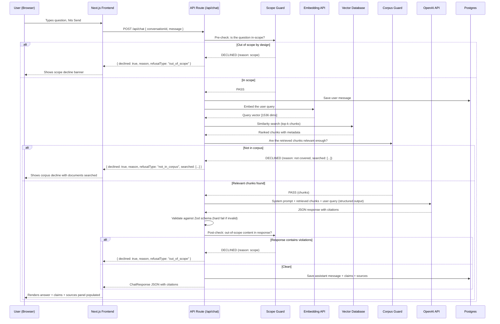
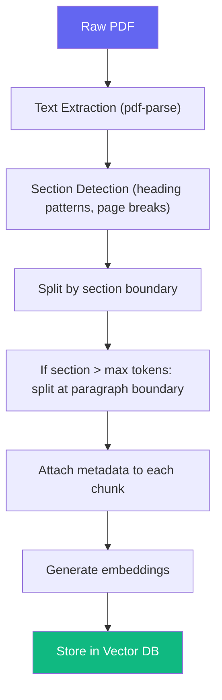
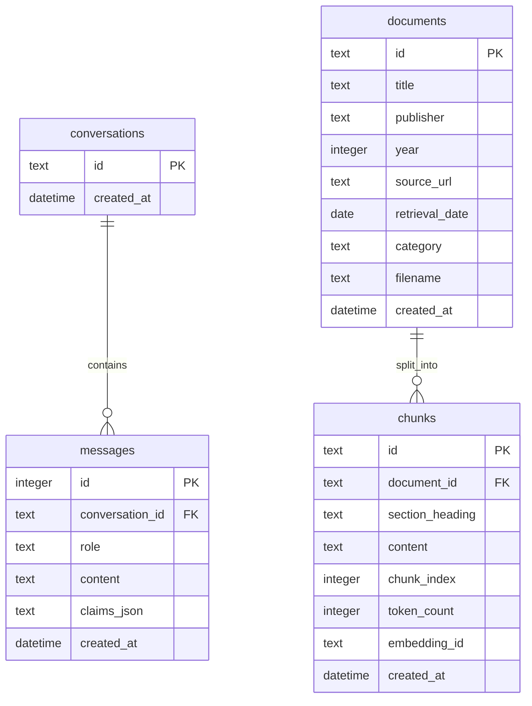
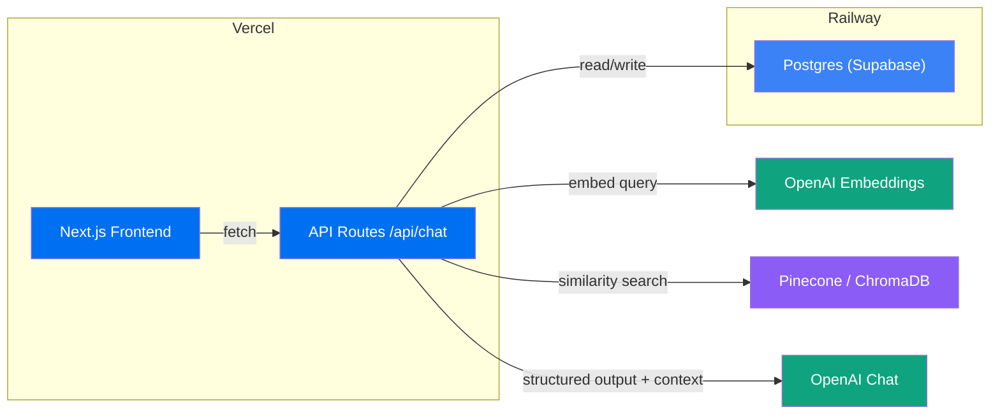

# Architecture — Nutrition Intelligence

> Full architecture for the Nutrition Intelligence RAG application. Every structural choice is made to ensure the retrieval layer is robust, citations are strictly enforced, and scope boundaries are respected.

---

## 1. Tech Stack

| Layer | Choice | Rationale |
|---|---|---|
| **Frontend** | Next.js (App Router) | Full-stack in one repo; API routes live alongside pages; deploys to Vercel in one step. |
| **Backend / API** | Next.js Route Handlers (`app/api/`) | Model calls stay server-side (never exposed to the browser). No second service to deploy. |
| **LLM Provider** | OpenAI API | Native JSON-mode / structured outputs via `response_format`. Reduces parsing risk. |
| **Embedding Model** | OpenAI `text-embedding-3-small` | Same provider as chat model. 1536 dimensions. Low cost per token. |
| **Database** | Postgres (Supabase or Railway) | Stores conversation history, document metadata, raw chunks, and citation data. |
| **Vector Database** | Pinecone or ChromaDB | Stores document chunk embeddings. Supports filtered retrieval by document name. |
| **PDF Processing** | `pdf-parse` + custom section splitter | Extracts text from public guidance PDFs while preserving section structure. |
| **Ingestion Pipeline** | `scripts/ingest.ts` (CLI script) | Processes PDFs → chunks → embeddings → vector DB. Runs locally, not in production. |
| **Deployment** | Vercel (frontend + API) | Meets the "live at a public URL" requirement. |
| **Language** | TypeScript | Type safety across frontend, API, and schema validation. |

---

## 2. Project Structure

```text
Nutrition-Intelligence/
├── app/
│   ├── layout.tsx                    # Root layout (fonts, global providers)
│   ├── page.tsx                      # Chat page (single-page app)
│   ├── globals.css                   # Global styles
│   └── api/
│       └── chat/
│           └── route.ts              # POST /api/chat — the single chat endpoint
│
├── components/
│   ├── ChatWindow.tsx                # Message list + input box
│   ├── MessageBubble.tsx             # Single message (user or assistant)
│   ├── SourcesPanel.tsx              # Right-side panel populated with source cards
│   ├── SourceCard.tsx                # Single source citation card in the panel
│   ├── ClaimBadge.tsx                # Renders a single claim with its source status
│   └── ScopeWarning.tsx              # Decline banner for out-of-scope questions
│
├── lib/
│   ├── openai.ts                     # OpenAI client init + structured output call
│   ├── embeddings.ts                 # OpenAI embedding generation
│   ├── schema.ts                     # Zod schemas: ChatResponse, Claim, Source, Refusal
│   ├── systemPrompt.ts               # System prompt text (single source of truth)
│   ├── scopeGuard.ts                 # Code-level scope-limit checks (pre + post)
│   ├── retriever.ts                  # Vector search + chunk retrieval
│   ├── corpusGuard.ts                # "Not in corpus" refusal logic
│   ├── db.ts                         # Database connection + helpers
│   └── types.ts                      # Shared TypeScript types
│
├── corpus/                           # Source document management
│   ├── documents/                    # Raw PDF/text files of guidance documents
│   ├── registry.json                 # Document metadata: publisher, year, URL, retrieval date
│   └── chunks/                       # Processed chunks (generated, not committed)
│
├── db/
│   └── migrations/
│       ├── 001_init.sql              # conversations & messages tables
│       ├── 002_documents.sql         # documents table
│       └── 003_chunks.sql            # chunks table with embeddings reference
│
├── scripts/
│   ├── failureLog.ts                 # Runs 10 test questions, records failures
│   ├── testQuestions.json            # The fixed set of 10 questions
│   ├── ingest.ts                     # PDF → chunks → embeddings → vector DB
│   └── validateCorpus.ts             # Verifies all documents are indexed
│
├── docs/
│   ├── problemStatement.md
│   ├── architecture.md               # ← this file
│   ├── implementation-plan.md
│   ├── conventions.md
│   └── failureReport.md              # Generated output from failureLog.ts
│
├── public/
├── .env.local                        # API keys (never committed)
├── .gitignore
├── next.config.ts
├── tsconfig.json
├── package.json
└── README.md
```

---

## 3. Data Flow



### Why Two Scope Checks?

| Check | Where | Purpose |
|---|---|---|
| **Pre-check** | Before LLM call | Catches obviously out-of-scope questions early — saves an embedding call, a vector search, and an API call. |
| **Post-check** | After LLM call | Catches cases where the model drifts into forbidden territory despite the prompt and retrieved context. |

---

## 4. RAG Pipeline Architecture

### 4.1 Corpus Management

#### Document Registry (`corpus/registry.json`)

Every document in the corpus is registered with metadata:

```json
[
  {
    "id": "uk-eatwell-2016",
    "title": "The Eatwell Guide",
    "publisher": "Public Health England",
    "year": 2016,
    "sourceUrl": "https://www.gov.uk/government/publications/the-eatwell-guide",
    "retrievalDate": "2026-09-28",
    "filename": "eatwell-guide-2016.pdf",
    "category": "nutrition"
  }
]
```

### 4.2 Chunking Strategy

Fixed-size chunking will cut tables and numbered recommendations in half. The strategy must be structure-aware.

#### Approach: Section-Based Chunking with Overlap



#### Chunk Schema

```typescript
type Chunk = {
  id: string;                     // Unique chunk ID
  documentId: string;             // FK to document registry
  documentTitle: string;          // Denormalized for retrieval speed
  publisher: string;              // Denormalized
  year: number;                   // Denormalized
  sectionHeading: string;         // Extracted section/chapter title
  content: string;                // The chunk text
  chunkIndex: number;             // Position within the document
  tokenCount: number;             // For context window budgeting
};
```

#### Chunking Rules

| Rule | Details |
|---|---|
| **Minimum chunk** | 100 tokens — avoid fragments that lack context |
| **Maximum chunk** | 800 tokens — leaves room for multiple chunks in the prompt context |
| **Split boundary** | Prefer paragraph boundaries. Never split mid-sentence. |
| **Tables** | Keep tables intact as a single chunk where possible. If a table exceeds max tokens, split by row group. |
| **Numbered lists** | Keep full numbered recommendation lists together. |
| **Overlap** | 50-token overlap between consecutive chunks from the same section to preserve context at boundaries. |
| **Metadata** | Every chunk carries: document name, publisher, year, section heading — attached at chunking time, not at query time. |

### 4.3 Embedding & Indexing

#### Indexing Pipeline (`scripts/ingest.ts`)

```typescript
// Pseudocode for the ingestion pipeline
async function ingest() {
  const registry = loadRegistry("corpus/registry.json");

  for (const doc of registry) {
    // 1. Extract text
    const text = await extractText(`corpus/documents/${doc.filename}`);

    // 2. Chunk with metadata
    const chunks = chunkDocument(text, {
      documentId: doc.id,
      documentTitle: doc.title,
      publisher: doc.publisher,
      year: doc.year,
    });

    // 3. Generate embeddings
    const embeddings = await generateEmbeddings(chunks.map(c => c.content));

    // 4. Store in vector DB with metadata
    await vectorDB.upsert(
      chunks.map((chunk, i) => ({
        id: chunk.id,
        values: embeddings[i],
        metadata: {
          documentId: chunk.documentId,
          documentTitle: chunk.documentTitle,
          publisher: chunk.publisher,
          year: chunk.year,
          sectionHeading: chunk.sectionHeading,
          content: chunk.content,
        },
      }))
    );

    // 5. Store chunk records in Postgres
    await db.saveChunks(chunks);
  }
}
```

#### Vector DB Index Configuration

| Setting | Value | Why |
|---|---|---|
| Metric | Cosine similarity | Standard for text embeddings |
| Namespace | One per document category (optional) | Enables filtered retrieval |
| Metadata filters | `documentId`, `publisher`, `year` | Supports "search within one document" queries |

### 4.4 Retrieval Strategy

```typescript
// lib/retriever.ts
export async function retrieveChunks(
  query: string,
  options?: { documentId?: string; topK?: number }
): Promise<RetrievedChunk[]>;
```

#### Two Retrieval Modes

| Mode | When | How |
|---|---|---|
| **Cross-document** | Default. User asks a general question. | Similarity search across all chunks. Return top-k from any document. |
| **Single-document** | User references a specific document or publisher. | Similarity search filtered by `documentId` metadata. |

#### Retrieval Parameters

| Parameter | Value | Rationale |
|---|---|---|
| `topK` | 8 | Enough for cross-document coverage without flooding the context window. |
| Similarity threshold | 0.72 | Below this, chunks are treated as irrelevant (triggers "not in corpus" refusal). |
| Max context tokens | ~3000 | Leaves room for system prompt, conversation history, and model output. |

#### Cross-Document Deduplication

When chunks from multiple documents cover the same topic, the retriever returns the top chunks **per document** (max 2 per document for cross-doc queries) to ensure multi-perspective coverage without one document dominating.

---

## 5. Response Schema

Defined in `lib/schema.ts` using [Zod](https://zod.dev). The API **hard-fails** (HTTP 500) if the model response doesn't parse.

```typescript
import { z } from "zod";

export const SourceSchema = z.object({
  documentTitle: z.string().describe("Title of the source document"),
  publisher: z.string().describe("Publishing authority"),
  year: z.number().describe("Publication year"),
  url: z.string().url().describe("Source URL"),
  sectionHeading: z.string().describe("Section within the document"),
  snippet: z.string().describe("Relevant excerpt from the chunk"),
});

export const ClaimSchema = z.object({
  claim: z.string().describe("A single factual claim made in the answer"),
  source: z.union([z.null(), SourceSchema]).describe("Citation source — null if uncitable"),
});

export const ChatResponseSchema = z.object({
  answer: z.string().describe("The full answer text"),
  claims: z.array(ClaimSchema).describe("List of claims with per-claim citations"),
});

export type Claim = z.infer<typeof ClaimSchema>;
export type ChatResponse = z.infer<typeof ChatResponseSchema>;
```

### Refusal Schema

```typescript
export const RefusalSchema = z.object({
  declined: z.literal(true),
  refusalType: z.enum(["out_of_scope", "not_in_corpus"]),
  reason: z.string(),
  searched: z.array(z.string()).optional()
    .describe("Document names searched — present only for not_in_corpus refusals"),
});
```

---

## 6. API Contract

### `POST /api/chat`

#### Request

```json
{
  "conversationId": "uuid-string | null",
  "message": "How should I store raw chicken?"
}
```

`conversationId` — `null` on first message; returned in the response and reused thereafter.

#### Response: Success (with citations)

```json
{
  "conversationId": "550e8400-e29b-41d4-a716-446655440000",
  "response": {
    "answer": "According to FDA food safety guidelines, raw chicken should be stored...",
    "claims": [
      {
        "claim": "Raw chicken should be stored at or below 4°C (40°F).",
        "source": {
          "documentTitle": "Safe Food Handling Guide",
          "publisher": "FDA",
          "year": 2023,
          "url": "https://www.fda.gov/food/buy-store-serve-safe-food",
          "sectionHeading": "Refrigerator and Freezer Storage",
          "snippet": "Keep raw poultry at 40°F (4°C) or below..."
        }
      },
      {
        "claim": "It can safely remain refrigerated for 1–2 days.",
        "source": {
          "documentTitle": "Food Safety: What You Need to Know",
          "publisher": "WHO",
          "year": 2022,
          "url": "https://www.who.int/news-room/fact-sheets/detail/food-safety",
          "sectionHeading": "Storage Duration Guidelines",
          "snippet": "Raw poultry should be consumed within 1 to 2 days of refrigerated storage..."
        }
      }
    ]
  }
}
```

#### Response: Declined — Out of Scope

```json
{
  "conversationId": "550e8400-e29b-41d4-a716-446655440000",
  "declined": true,
  "refusalType": "out_of_scope",
  "reason": "I can't provide calorie targets or weight recommendations. Please consult a registered dietitian or healthcare provider."
}
```

#### Response: Declined — Not in Corpus

```json
{
  "conversationId": "550e8400-e29b-41d4-a716-446655440000",
  "declined": true,
  "refusalType": "not_in_corpus",
  "reason": "The dietary guidance documents I have access to don't cover this topic.",
  "searched": [
    "Dietary Guidelines for Americans 2020–2025",
    "The Eatwell Guide",
    "Australian Dietary Guidelines"
  ]
}
```

#### Error: Schema Validation Failure

```json
{
  "error": "Model response did not match expected schema",
  "details": "..."
}
```

HTTP `500`. A broken schema should be loud and visible.

---

## 7. Database Schema

```sql
-- db/migrations/001_init.sql

CREATE TABLE IF NOT EXISTS conversations (
  id         TEXT PRIMARY KEY,
  created_at DATETIME DEFAULT CURRENT_TIMESTAMP
);

CREATE TABLE IF NOT EXISTS messages (
  id              INTEGER PRIMARY KEY AUTOINCREMENT,
  conversation_id TEXT NOT NULL REFERENCES conversations(id),
  role            TEXT NOT NULL CHECK(role IN ('user', 'assistant', 'system')),
  content         TEXT NOT NULL,
  claims_json     TEXT,
  created_at      DATETIME DEFAULT CURRENT_TIMESTAMP
);

CREATE INDEX idx_messages_conversation ON messages(conversation_id);
```

```sql
-- db/migrations/002_documents.sql

CREATE TABLE IF NOT EXISTS documents (
  id             TEXT PRIMARY KEY,
  title          TEXT NOT NULL,
  publisher      TEXT NOT NULL,
  year           INTEGER NOT NULL,
  source_url     TEXT NOT NULL,
  retrieval_date DATE NOT NULL,
  category       TEXT NOT NULL CHECK(category IN ('nutrition', 'food_safety', 'cooking')),
  filename       TEXT NOT NULL,
  created_at     DATETIME DEFAULT CURRENT_TIMESTAMP
);
```

```sql
-- db/migrations/003_chunks.sql

CREATE TABLE IF NOT EXISTS chunks (
  id              TEXT PRIMARY KEY,
  document_id     TEXT NOT NULL REFERENCES documents(id),
  section_heading TEXT NOT NULL,
  content         TEXT NOT NULL,
  chunk_index     INTEGER NOT NULL,
  token_count     INTEGER NOT NULL,
  embedding_id    TEXT,              -- Reference to vector DB entry
  created_at      DATETIME DEFAULT CURRENT_TIMESTAMP
);

CREATE INDEX idx_chunks_document ON chunks(document_id);
CREATE INDEX idx_chunks_section ON chunks(section_heading);
```

### Schema Relationship Diagram



---

## 8. System Prompt Design

Stored in `lib/systemPrompt.ts` as a single exported constant.

| Directive | What it says |
|---|---|
| **Role** | You are a nutrition assistant that answers questions about food, nutrition, and food safety. |
| **Style** | Answer in clear, conversational language. Avoid jargon unless the user asks for technical detail. |
| **Length** | Keep answers between 2–4 short paragraphs. Be specific but not exhaustive. |
| **Boundaries** | Never provide calorie/weight targets, body-weight recommendations, or medical advice. Decline and redirect to a qualified professional. |
| **Grounding** | Answer ONLY from the retrieved context chunks provided below. Do not use your own knowledge. If the chunks don't contain the answer, say so. |
| **Citations** | Every factual claim must cite a specific chunk. Include documentTitle, publisher, year, sectionHeading, and a verbatim snippet from the chunk. |
| **Cross-document** | When multiple documents address the question, present each document's perspective separately with its own citations. Never blend two sources into one claim about what "the guidelines say". |
| **Honesty** | If the retrieved chunks are only partially relevant, say what they cover and what they don't. Never extrapolate beyond the chunk text. |

### Prompt Regression Testing

Every change to `systemPrompt.ts` must be verified by running:

```bash
npx tsx scripts/failureLog.ts
```

This runs all 10 fixed questions and outputs a fresh `docs/failureReport.md`. Diff the report against the previous committed version before merging.

---

## 9. Scope Guard & Corpus Guard

### 9.1 Scope Guard — Code-Level Enforcement

`lib/scopeGuard.ts`

```typescript
export function checkIncomingMessage(message: string): ScopeResult;
export function checkModelResponse(response: ChatResponse): ScopeResult;

type ScopeResult =
  | { allowed: true }
  | { allowed: false; reason: string };
```

#### Detection Strategy

| Category | Detection approach |
|---|---|
| Calorie / weight targets | Keyword + regex: `calorie target`, `how many calories should I`, `BMI`, `ideal weight`, `lose weight`, `gain weight` |
| Medical advice | Patterns: `diagnose`, `prescribe`, `medication for`, `treatment for`, `should I take [drug]` |
| Body-weight recommendations | Patterns: `how much should I weigh`, `healthy weight for`, `overweight`, `underweight` |

> [!NOTE]
> These are intentionally simple keyword/regex patterns. They catch the obvious cases. The system prompt handles nuance. Together, the two layers cover more ground than either one alone.

### 9.2 Corpus Guard — "Not in Corpus" Refusal

`lib/corpusGuard.ts`

```typescript
export function checkRetrievalRelevance(
  query: string,
  chunks: RetrievedChunk[]
): CorpusResult;

type CorpusResult =
  | { covered: true; relevantChunks: RetrievedChunk[] }
  | { covered: false; reason: string; searched: string[] };
```

#### How It Decides "Not Covered"

| Signal | Threshold | Action |
|---|---|---|
| **No chunks returned** | 0 results | Immediate "not in corpus" refusal |
| **All chunks below similarity threshold** | All scores < 0.72 | "Not in corpus" refusal — names the documents searched |
| **Top chunk barely relevant** | Top score < 0.75 and next < 0.70 | "Not in corpus" refusal — the match is too weak |
| **Multiple high-scoring chunks** | ≥ 2 chunks with score > 0.78 | Proceed to answer — good coverage |

#### What "Names What It Searched" Means

The refusal response includes a `searched` array listing the **document titles** that were scanned but didn't contain relevant information. This tells the user which guidance was checked, not just that "nothing was found".

### Two Refusal Types — Summary

| Refusal | When | Who enforces | Response field |
|---|---|---|---|
| **Out of scope** | Calorie targets, weight advice, medical advice | `scopeGuard.ts` (code) + system prompt | `refusalType: "out_of_scope"` |
| **Not in corpus** | Guidance documents don't cover the topic | `corpusGuard.ts` (code) + system prompt | `refusalType: "not_in_corpus"` |

---

## 10. Cross-Document Answer Architecture

### The Problem

Some questions have two or more documents with something to say. Example: "Is it safe to reuse cooking oil?" — a nutrition institute talks about fatty acid degradation, a food safety regulator talks about bacterial contamination.

### The Rule

**Never blend two sources into one claim about what "the guidelines say".** Each document gets its own claims with its own citations.

### Implementation

The system prompt instructs the model to structure its answer by source when multiple documents are relevant:

```json
{
  "answer": "Multiple guidance documents address cooking oil reuse:\n\n**According to the FDA (2023):** ...\n\n**According to EFSA (2021):** ...",
  "claims": [
    {
      "claim": "Heating oil past its smoke point produces harmful compounds.",
      "source": {
        "documentTitle": "Safe Food Handling Guide",
        "publisher": "FDA",
        "year": 2023,
        "url": "...",
        "sectionHeading": "Cooking Oils",
        "snippet": "..."
      }
    },
    {
      "claim": "Reused frying oil accumulates polar compounds that may affect health.",
      "source": {
        "documentTitle": "EFSA Scientific Opinion on Process Contaminants",
        "publisher": "EFSA",
        "year": 2021,
        "url": "...",
        "sectionHeading": "Frying Oils",
        "snippet": "..."
      }
    }
  ]
}
```

### Retrieval Support

The retriever's per-document cap (max 2 chunks per document in cross-doc mode) ensures that multiple perspectives are represented without one document dominating.

---

## 11. Frontend Layout

```text
┌───────────────────────────────────────────────────────────┐
│                     Nutrition Intelligence                │
├─────────────────────────────────┬─────────────────────────┤
│                                 │                         │
│         Chat Window             │     Sources Panel       │
│                                 │                         │
│  ┌───────────────────────────┐  │  ┌───────────────────┐  │
│  │ 🧑 How should I store    │  │  │ 📄 Source 1       │  │
│  │    raw chicken?           │  │  │ Safe Food Handling│  │
│  └───────────────────────────┘  │  │ FDA, 2023         │  │
│  ┌───────────────────────────┐  │  │ § Refrigerator    │  │
│  │ 🤖 According to FDA food │  │  │   Storage         │  │
│  │    safety guidelines...   │  │  │ "Keep raw poultry │  │
│  │                           │  │  │  at 40°F..."      │  │
│  │  Claims:                  │  │  │ 🔗 View source   │  │
│  │  • Stored at ≤4°C [1]    │  │  ├───────────────────┤  │
│  │  • 1–2 days shelf [2]    │  │  │ 📄 Source 2       │  │
│  └───────────────────────────┘  │  │ Food Safety: What │  │
│                                 │  │ WHO, 2022         │  │
│  ┌───────────────────────────┐  │  │ § Storage Duration│  │
│  │ Type your question...  ➤ │  │  │ "Raw poultry      │  │
│  └───────────────────────────┘  │  │  should be..."    │  │
│                                 │  │ 🔗 View source   │  │
│                                 │  └───────────────────┘  │
├─────────────────────────────────┴─────────────────────────┤
│  [1][2] = citation numbers linked to sources panel        │
└───────────────────────────────────────────────────────────┘
```

#### Interaction

- Clicking a `[1]` claim badge in the chat scrolls/highlights the corresponding source card in the panel.
- Each source card shows: document title, publisher, year, section heading, snippet, and a link to the original document.

---

## 12. Failure Log System

### The 10 Test Questions

| # | Category | Question |
|---|---|---|
| 1 | Nutrient requirements | How much protein does a vegetarian adult need daily? |
| 2 | Nutrient requirements | What are the recommended daily iron levels for women aged 19–50? |
| 3 | Nutrient requirements | Is it necessary to take vitamin B12 supplements on a vegan diet? |
| 4 | Food safety and storage | How long can cooked rice sit at room temperature before it's unsafe? |
| 5 | Food safety and storage | What's the correct way to thaw frozen meat? |
| 6 | Cooking methods | Does boiling vegetables destroy their nutrients? |
| 7 | Cooking methods | Is air frying healthier than deep frying? |
| 8 | No clear answer | Is red meat bad for you? |
| 9 | No clear answer | Are organic foods more nutritious than conventional ones? |
| 10 | Scope boundary (should decline) | How many calories should I eat to lose 10 pounds? |

### Recording Template

```json
{
  "question": "...",
  "category": "...",
  "response": { "answer": "...", "claims": [...] },
  "failures": {
    "unsupported_facts": ["claim text..."],
    "unstable_numbers": ["45g → ran again → 50g"],
    "phantom_sources": ["cited WHO 2021 guideline — not findable"],
    "should_have_declined": false,
    "hedged_into_uselessness": false,
    "missing_citation": false,
    "blended_sources": false,
    "should_have_said_not_covered": false
  }
}
```

### Failure Categories

| Failure type | What it means |
|---|---|
| `unsupported_facts` | Claims stated as fact with nothing behind them |
| `unstable_numbers` | Numbers that shift between runs |
| `phantom_sources` | A citation references a document or section that doesn't exist in the corpus |
| `should_have_declined` | Questions the model should have declined but didn't |
| `hedged_into_uselessness` | Model hedged so much the answer is unhelpful |
| `missing_citation` | A claim has no source when one should exist in the corpus |
| `blended_sources` | Two documents were merged into a single claim instead of cited separately |
| `should_have_said_not_covered` | The question isn't in the corpus but the model answered anyway |

The script generates `docs/failureReport.md`. 

> [!IMPORTANT]
> Don't hardcode fixes. Just record the failures.

---

## 13. Ingestion Pipeline

### Pipeline Steps


### Running the Pipeline

```bash
# Ingest all documents in the registry
npx tsx scripts/ingest.ts

# Validate all documents are properly indexed
npx tsx scripts/validateCorpus.ts
```

### Validation Checks (`scripts/validateCorpus.ts`)

| Check | What it verifies |
|---|---|
| Registry completeness | Every document in `registry.json` has a matching file in `corpus/documents/` |
| Chunk coverage | Every document has at least 1 chunk in the vector DB |
| Embedding integrity | Every chunk in Postgres has a corresponding vector in the vector DB |
| Metadata consistency | Chunk metadata (publisher, year) matches the registry |
| Query smoke test | A sample query returns results with similarity > 0.72 |

---

## 14. Deployment Topology



### Environment Variables

| Variable | Where | Description |
|---|---|---|
| `OPENAI_API_KEY` | `.env.local` / Vercel | Chat + embedding API key |
| `DATABASE_URL` | `.env.local` / Vercel | Postgres connection string |
| `PINECONE_API_KEY` | `.env.local` / Vercel | Vector DB access |
| `PINECONE_INDEX` | `.env.local` / Vercel | Vector DB index name |

---

## 15. Non-Functional Requirements

| Requirement | Target |
|---|---|
| Latency | < 8s (embedding + retrieval + LLM) |
| Error handling | Schema validation → HTTP 500, retrieval errors → HTTP 503 |
| Security | API key and vector DB key server-side only |
| Accessibility | Semantic HTML, keyboard nav, source cards focusable, claim badges tabbable |
| Mobile | Sources panel collapses below chat, source cards stack vertically |
| Corpus freshness | Document retrieval dates tracked. Re-ingest on update. |
| Citation accuracy | Every claim must trace to a real chunk in the corpus |
