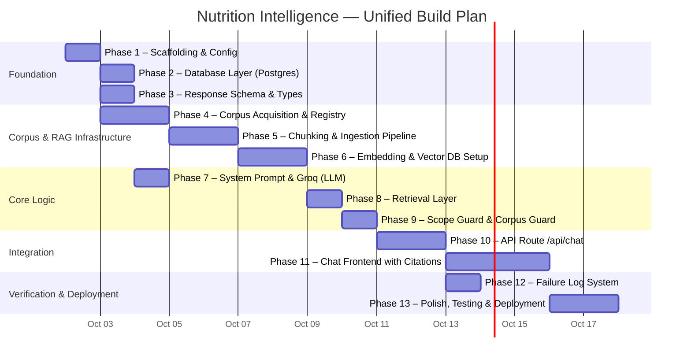
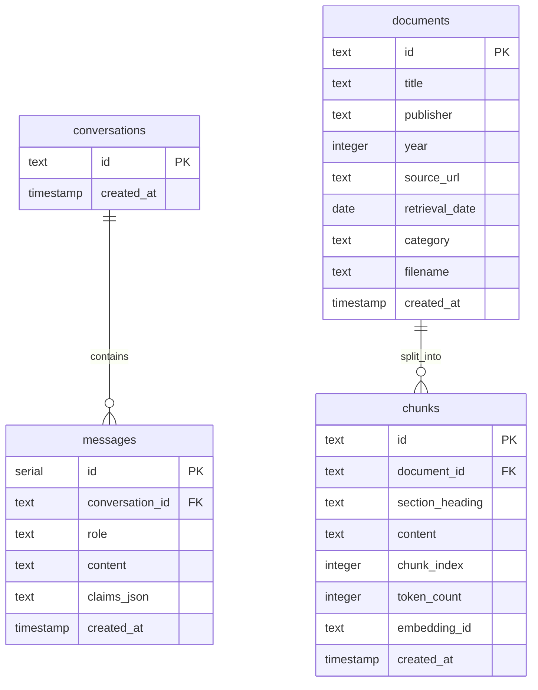
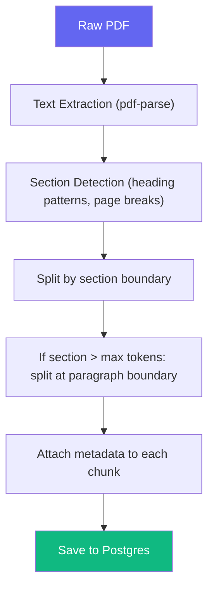
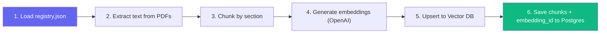
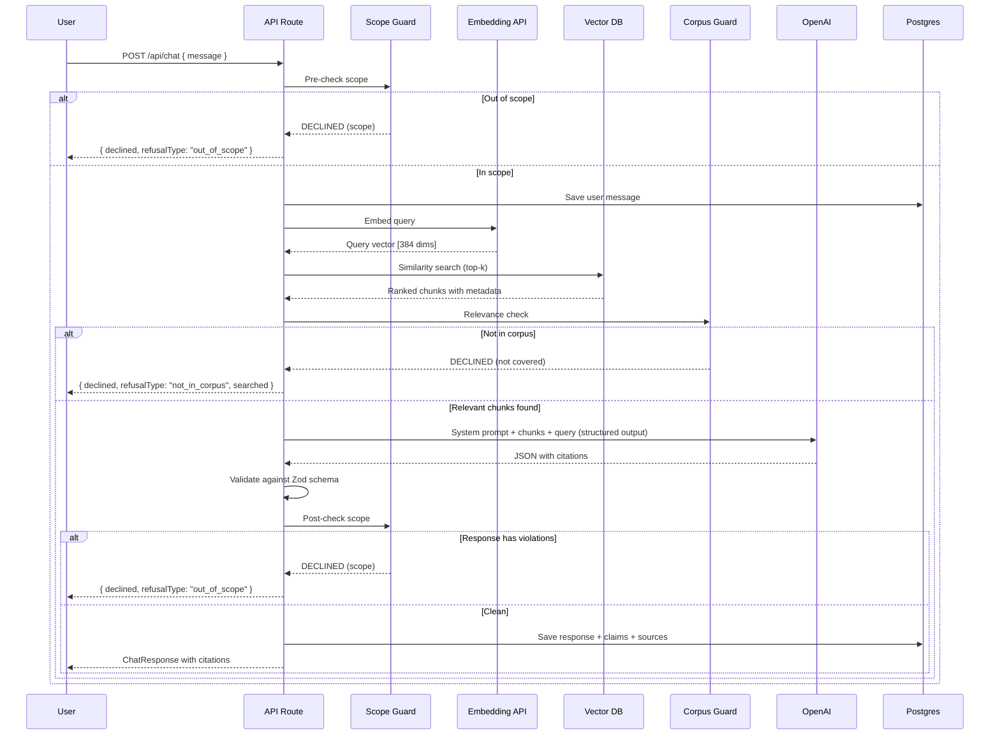
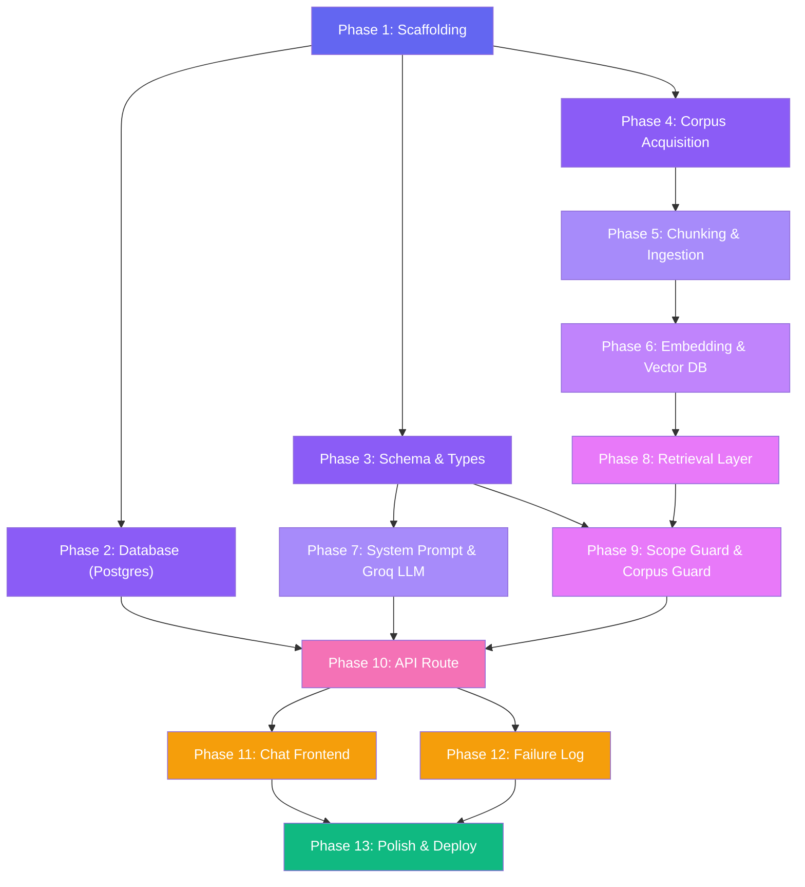

# Implementation Plan — Nutrition Intelligence

> Phase-wise build plan derived from [architecture.md](file:///Users/mna/Nutrition-Intelligence/architecture.md) and [problemStatement.md](file:///Users/mna/Nutrition-Intelligence/problemStatement.md).
> Each phase ends with a **checkpoint** — a concrete, testable state the app must be in before moving on.

---

## Overview



---

## Phase 1 — Project Scaffolding & Configuration

**Goal**: A running Next.js app with all dependencies installed — including RAG infrastructure — and environment configured.

### Tasks

| #   | Task                                                                 | File(s)                          |
|-----|----------------------------------------------------------------------|----------------------------------|
| 1.1 | Initialize Next.js project with App Router + TypeScript              | `package.json`, `tsconfig.json`  |
| 1.2 | Install core dependencies: `zod`, `openai`, `uuid`                  | `package.json`                   |
| 1.3 | Install database dependencies: `pg`, `@types/pg`                     | `package.json`                   |
| 1.4 | Install RAG dependencies: `pdf-parse`, `@pinecone-database/pinecone` | `package.json`                   |
| 1.5 | Install dev dependencies: `tsx`, `@types/uuid`                       | `package.json`                   |
| 1.6 | Create `.env.local` with all keys: `GROQ_API_KEY`, `DATABASE_URL`, `PINECONE_API_KEY`, `PINECONE_INDEX` | `.env.local` |
| 1.7 | Update `.gitignore` — add `.env.local`, `node_modules`, `corpus/chunks/` | `.gitignore`                 |
| 1.8 | Create folder structure: `lib/`, `components/`, `db/migrations/`, `scripts/`, `docs/`, `corpus/documents/`, `corpus/chunks/` | — |
| 1.9 | Verify `npm run dev` starts successfully on `localhost:3000`          | —                                |

### Commands

```bash
npx -y create-next-app@latest ./ --typescript --app --eslint --src-dir=false --no-tailwind --import-alias="@/*"
npm install zod openai uuid pg pdf-parse @pinecone-database/pinecone
npm install -D @types/pg @types/uuid tsx
```

### Checkpoint ✅

- [ ] `npm run dev` serves a page at `http://localhost:3000`
- [ ] All dependencies resolve without errors
- [ ] `.env.local` exists with all four environment variable placeholders
- [ ] Full folder structure is in place (including `corpus/`)

---

## Phase 2 — Database Layer (Postgres)

**Goal**: Postgres database with all four tables — conversations, messages, documents, chunks — plus helper functions.

### Tasks

| #   | Task                                                                          | File(s)                          |
|-----|-------------------------------------------------------------------------------|----------------------------------|
| 2.1 | Provision Postgres instance (Supabase or Railway)                             | —                                |
| 2.2 | Set `DATABASE_URL` in `.env.local`                                            | `.env.local`                     |
| 2.3 | Write SQL migration: `conversations` and `messages` tables                    | `db/migrations/001_init.sql`     |
| 2.4 | Write SQL migration: `documents` table                                        | `db/migrations/002_documents.sql`|
| 2.5 | Write SQL migration: `chunks` table with `embedding_id` reference             | `db/migrations/003_chunks.sql`   |
| 2.6 | Create database connection module with auto-migration on first load           | `lib/db.ts`                      |
| 2.7 | Implement conversation helpers:                                               | `lib/db.ts`                      |
|     | — `createConversation(id: string): void`                                      |                                  |
|     | — `saveMessage(conversationId, role, content, claimsJson?): void`             |                                  |
|     | — `getMessages(conversationId): Message[]`                                    |                                  |
| 2.8 | Implement document/chunk helpers:                                             | `lib/db.ts`                      |
|     | — `saveDocument(doc): void`                                                   |                                  |
|     | — `saveChunks(chunks[]): void`                                                |                                  |
|     | — `getChunksByDocument(documentId): Chunk[]`                                  |                                  |
| 2.9 | Manual test: create conversation, insert messages, query back                 | —                                |

### Schema

```sql
-- db/migrations/001_init.sql
CREATE TABLE IF NOT EXISTS conversations (
  id         TEXT PRIMARY KEY,
  created_at TIMESTAMP DEFAULT CURRENT_TIMESTAMP
);

CREATE TABLE IF NOT EXISTS messages (
  id              SERIAL PRIMARY KEY,
  conversation_id TEXT NOT NULL REFERENCES conversations(id),
  role            TEXT NOT NULL CHECK(role IN ('user', 'assistant', 'system')),
  content         TEXT NOT NULL,
  claims_json     TEXT,
  created_at      TIMESTAMP DEFAULT CURRENT_TIMESTAMP
);

CREATE INDEX idx_messages_conversation ON messages(conversation_id);
```

```sql
-- db/migrations/002_documents.sql
CREATE TABLE IF NOT EXISTS documents (
  id             TEXT PRIMARY KEY,
  title          TEXT NOT NULL,
  publisher      TEXT NOT NULL,
  year           INTEGER NOT NULL,
  source_url     TEXT NOT NULL,
  retrieval_date DATE NOT NULL,
  category       TEXT NOT NULL CHECK(category IN ('nutrition', 'food_safety', 'cooking')),
  filename       TEXT NOT NULL,
  created_at     TIMESTAMP DEFAULT CURRENT_TIMESTAMP
);
```

```sql
-- db/migrations/003_chunks.sql
CREATE TABLE IF NOT EXISTS chunks (
  id              TEXT PRIMARY KEY,
  document_id     TEXT NOT NULL REFERENCES documents(id),
  section_heading TEXT NOT NULL,
  content         TEXT NOT NULL,
  chunk_index     INTEGER NOT NULL,
  token_count     INTEGER NOT NULL,
  embedding_id    TEXT,
  created_at      TIMESTAMP DEFAULT CURRENT_TIMESTAMP
);

CREATE INDEX idx_chunks_document ON chunks(document_id);
CREATE INDEX idx_chunks_section ON chunks(section_heading);
```

### Schema Relationship Diagram



### Checkpoint ✅

- [ ] Postgres instance is running and reachable via `DATABASE_URL`
- [ ] All four tables created via auto-migration
- [ ] `createConversation` + `saveMessage` + `getMessages` work round-trip
- [ ] `saveDocument` + `saveChunks` + `getChunksByDocument` work round-trip

---

## Phase 3 — Response Schema & Types

**Goal**: Zod schemas and TypeScript types that define the full contract — including citations and refusals.

### Tasks

| #   | Task                                                                              | File(s)          |
|-----|-----------------------------------------------------------------------------------|------------------|
| 3.1 | Define `SourceSchema` — documentTitle, publisher, year, url, sectionHeading, snippet | `lib/schema.ts` |
| 3.2 | Define `ClaimSchema` — `{ claim: string, source: null \| Source }`                | `lib/schema.ts`  |
| 3.3 | Define `ChatResponseSchema` — `{ answer: string, claims: Claim[] }`              | `lib/schema.ts`  |
| 3.4 | Define `RefusalSchema` — `{ declined, refusalType, reason, searched? }`           | `lib/schema.ts`  |
| 3.5 | Export inferred types: `Source`, `Claim`, `ChatResponse`                          | `lib/schema.ts`  |
| 3.6 | Define API-level types: `ChatRequest`, `ChatAPIResponse`, `DeclinedResponse`     | `lib/types.ts`   |
| 3.7 | Write parse tests with valid/invalid JSON blobs                                   | —                |

### Schema Definitions

```typescript
import { z } from "zod";

export const SourceSchema = z.object({
  documentTitle: z.string().describe("Title of the source document"),
  publisher: z.string().describe("Publishing authority"),
  year: z.number().describe("Publication year"),
  url: z.string().url().describe("Source URL"),
  sectionHeading: z.string().describe("Section within the document"),
  snippet: z.string().describe("Relevant excerpt from the chunk"),
});

export const ClaimSchema = z.object({
  claim: z.string().describe("A single factual claim made in the answer"),
  source: z.union([z.null(), SourceSchema]).describe("Citation source — null if uncitable"),
});

export const ChatResponseSchema = z.object({
  answer: z.string().describe("The full answer text"),
  claims: z.array(ClaimSchema).describe("List of claims with per-claim citations"),
});

export const RefusalSchema = z.object({
  declined: z.literal(true),
  refusalType: z.enum(["out_of_scope", "not_in_corpus"]),
  reason: z.string(),
  searched: z.array(z.string()).optional()
    .describe("Document names searched — present only for not_in_corpus refusals"),
});
```

### Key Constraint

```typescript
// Parsing MUST hard-fail. No try/catch that silently returns a fallback.
const parsed = ChatResponseSchema.parse(modelOutput); // throws ZodError
```

### Checkpoint ✅

- [ ] Valid JSON with sources parses successfully and returns typed objects
- [ ] Valid JSON with `source: null` also parses (backwards-compatible)
- [ ] Invalid JSON (missing `claims`, wrong `source` shape) throws `ZodError`
- [ ] Types are importable across `lib/` and `components/`

---

## Phase 4 — Corpus Acquisition & Registry

**Goal**: 20–25 public dietary guidance documents gathered, registered, and stored with full metadata.

### Tasks

| #    | Task                                                                 | File(s)                         |
|------|----------------------------------------------------------------------|---------------------------------|
| 4.1 | Define `corpus/registry.json` schema and create the file              | `corpus/registry.json`          |
| 4.2 | Research and select 20–25 documents following selection criteria       | —                               |
| 4.3 | Download all PDF/text source documents                                | `corpus/documents/`             |
| 4.4 | Register each document with full metadata in `registry.json`          | `corpus/registry.json`          |
| 4.5 | Verify all files are present and metadata is complete                  | —                               |

### Document Selection Criteria

| Criterion       | Rule                                                                               |
|-----------------|-------------------------------------------------------------------------------------|
| **Authority**   | National nutrition institutes, food safety regulators, international health bodies (WHO, FAO) |
| **Format**      | Written prose only. If a source has a clean structured API, it doesn't belong here (M3). |
| **Count**       | 20–25 documents                                                                     |
| **Content type**| Dietary guidance, food safety guidelines, cooking/storage recommendations            |
| **Exclusions**  | Nutrient databases (e.g., USDA FoodData Central) — those are structured data for M3 |

### Registry Schema

```json
[
  {
    "id": "uk-eatwell-2016",
    "title": "The Eatwell Guide",
    "publisher": "Public Health England",
    "year": 2016,
    "sourceUrl": "https://www.gov.uk/government/publications/the-eatwell-guide",
    "retrievalDate": "2026-09-28",
    "filename": "eatwell-guide-2016.pdf",
    "category": "nutrition"
  }
]
```

### Corpus Sources

The full list of 22 curated dietary guidance documents (including the Dietary Guidelines for Americans, WHO manuals, and international equivalents) is maintained in `problemStatement.md`.

*(The corpus registry is tracked locally via `corpus/registry.json`.)*

### Checkpoint ✅

- [ ] `corpus/registry.json` contains 20–25 entries with complete metadata
- [ ] Every entry has a matching file in `corpus/documents/`
- [ ] Each document has: `id`, `title`, `publisher`, `year`, `sourceUrl`, `retrievalDate`, `filename`, `category`
- [ ] All documents are from recognised, authoritative sources

---

## Phase 5 — Chunking & Ingestion Pipeline

**Goal**: A CLI script that processes PDFs into structured, metadata-enriched chunks stored in Postgres.

### Tasks

| #    | Task                                                                       | File(s)                    |
|------|----------------------------------------------------------------------------|----------------------------|
| 5.1 | Build text extraction using `pdf-parse`                                     | `scripts/ingest.ts`        |
| 5.2 | Build section detection logic (heading patterns, page breaks)               | `scripts/ingest.ts`        |
| 5.3 | Build section-based chunking with overlap                                   | `scripts/ingest.ts`        |
| 5.4 | Attach metadata to each chunk (documentId, title, publisher, year, section) | `scripts/ingest.ts`        |
| 5.5 | Save documents to `documents` table and chunks to `chunks` table            | `scripts/ingest.ts`        |
| 5.6 | Run the chunking pipeline on all corpus documents                           | —                          |
| 5.7 | Verify chunk quality: spot-check section boundaries, table preservation     | —                          |

### Chunking Strategy



### Chunking Rules

| Rule              | Details                                                                             |
|-------------------|-------------------------------------------------------------------------------------|
| **Minimum chunk** | 100 tokens — avoid fragments that lack context                                      |
| **Maximum chunk** | 800 tokens — leaves room for multiple chunks in the prompt context                  |
| **Split boundary**| Prefer paragraph boundaries. Never split mid-sentence.                               |
| **Tables**        | Keep tables intact as a single chunk where possible. If a table exceeds max tokens, split by row group. |
| **Numbered lists**| Keep full numbered recommendation lists together.                                    |
| **Overlap**       | 50-token overlap between consecutive chunks from the same section.                  |
| **Metadata**      | Every chunk carries: document name, publisher, year, section heading — attached at chunking time. |

### Chunk Schema

```typescript
type Chunk = {
  id: string;                     // Unique chunk ID
  documentId: string;             // FK to document registry
  documentTitle: string;          // Denormalized for retrieval speed
  publisher: string;              // Denormalized
  year: number;                   // Denormalized
  sectionHeading: string;         // Extracted section/chapter title
  content: string;                // The chunk text
  chunkIndex: number;             // Position within the document
  tokenCount: number;             // For context window budgeting
};
```

### Checkpoint ✅

- [ ] `npx tsx scripts/ingest.ts` processes all corpus documents without errors
- [ ] Every document in `registry.json` has chunks in the `chunks` table
- [ ] No chunk is below 100 tokens or above 800 tokens
- [ ] Tables and numbered lists are kept intact where possible
- [ ] Section headings are correctly extracted (spot-check 3–5 documents)

---

## Phase 6 — Embedding & Vector DB Setup

**Goal**: All chunks are embedded and stored in a vector database, ready for similarity search.

### Tasks

| #    | Task                                                                          | File(s)                   |
|------|-------------------------------------------------------------------------------|---------------------------|
| 6.1 | Provision Pinecone index (or ChromaDB on Railway)                              | —                         |
| 6.2 | Set `PINECONE_API_KEY` and `PINECONE_INDEX` in `.env.local`                    | `.env.local`              |
| 6.3 | Create `lib/embeddings.ts` — OpenAI embedding generation wrapper               | `lib/embeddings.ts`       |
| 6.4 | Extend `scripts/ingest.ts` to generate embeddings and upsert to vector DB      | `scripts/ingest.ts`       |
| 6.5 | Store `embedding_id` back in Postgres `chunks` table                           | `scripts/ingest.ts`       |
| 6.6 | Run full ingestion pipeline: chunks → embeddings → vector DB → Postgres        | —                         |
| 6.7 | Build `scripts/validateCorpus.ts` — verify all documents are properly indexed  | `scripts/validateCorpus.ts`|

### Embedding Model

| Property      | Value                      |
|---------------|----------------------------|
| Model         | `Xenova/all-MiniLM-L6-v2`   |
| Dimensions    | 384                       |
| Max input     | 8191 tokens                |
| Cost          | ~$0.02 per 1M tokens       |

### Vector DB Index Configuration

| Setting          | Value                                              | Why                                  |
|------------------|----------------------------------------------------|--------------------------------------|
| Metric           | Cosine similarity                                  | Standard for text embeddings         |
| Namespace        | One per document category (optional)               | Enables filtered retrieval           |
| Metadata filters | `documentId`, `publisher`, `year`                  | Supports "search within one document" queries |

### Ingestion Pipeline Flow



### Validation Checks (`scripts/validateCorpus.ts`)

| Check                  | What it verifies                                                        |
|------------------------|-------------------------------------------------------------------------|
| Registry completeness  | Every document in `registry.json` has a matching file in `corpus/documents/` |
| Chunk coverage         | Every document has at least 1 chunk in the vector DB                    |
| Embedding integrity    | Every chunk in Postgres has a corresponding vector in the vector DB     |
| Metadata consistency   | Chunk metadata (publisher, year) matches the registry                   |
| Query smoke test       | A sample query returns results with similarity > 0.72                   |

### Running the Pipeline

```bash
# Ingest all documents in the registry
npx tsx scripts/ingest.ts

# Validate all documents are properly indexed
npx tsx scripts/validateCorpus.ts
```

### Checkpoint ✅

- [ ] Vector DB instance is provisioned and accessible
- [ ] `npx tsx scripts/ingest.ts` embeds and upserts all chunks without errors
- [ ] `npx tsx scripts/validateCorpus.ts` passes all 5 validation checks
- [ ] A sample similarity query returns relevant chunks with scores > 0.72
- [ ] Every chunk in Postgres has a non-null `embedding_id`

---

## Phase 7 — System Prompt & Groq LLM Integration

**Goal**: A working Groq (openai/gpt-oss-120b) call with a RAG-grounded system prompt that returns structured JSON with citations.

### Tasks

| #   | Task                                                                         | File(s)              |
|-----|------------------------------------------------------------------------------|----------------------|
| 7.1 | Write the system prompt covering: role, style, length, boundaries            | `lib/systemPrompt.ts`|
| 7.2 | Add grounding directive: answer ONLY from retrieved context chunks           | `lib/systemPrompt.ts`|
| 7.3 | Add citation directive: every claim must cite document, publisher, year, section, snippet | `lib/systemPrompt.ts`|
| 7.4 | Add cross-document directive: present each document's perspective separately | `lib/systemPrompt.ts`|
| 7.5 | Add honesty directive: state what chunks cover and what they don't           | `lib/systemPrompt.ts`|
| 7.6 | Create Groq client wrapper (using OpenAI SDK configured for Groq base URL) | `lib/openai.ts`      |
| 7.7 | Implement `getChatCompletion(messages, chunks?): ChatResponse`               | `lib/openai.ts`      |
|     | — Uses `response_format` for structured output                               |                      |
|     | — Injects retrieved chunks into the prompt when present                      |                      |
|     | — Parses response through `ChatResponseSchema.parse()`                       |                      |
|     | — Throws on parse failure (no silent fallback)                               |                      |
| 7.8 | Manual test: call with hardcoded question + sample chunks, verify schema-valid JSON | —               |

### System Prompt Directives

| Directive | What it says |
|---|---|
| **Role** | You are a nutrition assistant that answers questions about food, nutrition, and food safety. |
| **Style** | Answer in clear, conversational language. Avoid jargon unless the user asks for technical detail. |
| **Length** | Keep answers between 2–4 short paragraphs. Be specific but not exhaustive. |
| **Boundaries** | Never provide calorie/weight targets, body-weight recommendations, or medical advice. Decline and redirect to a qualified professional. |
| **Grounding** | Answer ONLY from the retrieved context chunks provided below. Do not use your own knowledge. If the chunks don't contain the answer, say so. |
| **Citations** | Every factual claim must cite a specific chunk. Include documentTitle, publisher, year, sectionHeading, and a verbatim snippet from the chunk. |
| **Cross-document** | When multiple documents address the question, present each document's perspective separately with its own citations. Never blend two sources into one claim about what "the guidelines say". |
| **Honesty** | If the retrieved chunks are only partially relevant, say what they cover and what they don't. Never extrapolate beyond the chunk text. |
| **Output** | Return JSON matching the ChatResponse schema, with every factual claim in the claims array and its source. |

### Checkpoint ✅

- [x] `getChatCompletion` returns a valid `ChatResponse` object with populated `source` fields
- [x] `claims` array is populated (not empty) for factual questions with chunks
- [x] Each `source` includes: `documentTitle`, `publisher`, `year`, `url`, `sectionHeading`, `snippet`
- [x] Boundary questions receive a decline in the answer text

---

## Phase 8 — Retrieval Layer

**Goal**: A retrieval module that embeds the user query, searches the vector DB, and returns ranked chunks.

### Tasks

| #    | Task                                                                         | File(s)                |
|------|------------------------------------------------------------------------------|------------------------|
| 8.1 | Create `lib/retriever.ts` — vector search + chunk retrieval                   | `lib/retriever.ts`     |
| 8.2 | Implement `retrieveChunks(query, options?)` with two retrieval modes          | `lib/retriever.ts`     |
|      | — **Cross-document**: similarity search across all chunks (default)          |                        |
|      | — **Single-document**: filtered by `documentId` metadata                     |                        |
| 8.3 | Implement per-document deduplication (max 2 chunks per document in cross-doc) | `lib/retriever.ts`     |
| 8.4 | Test retrieval with diverse queries — verify chunk relevance and dedup        | —                      |

### Retrieval API

```typescript
// lib/retriever.ts
export async function retrieveChunks(
  query: string,
  options?: { documentId?: string; topK?: number }
): Promise<RetrievedChunk[]>;
```

### Two Retrieval Modes

| Mode                | When                                         | How                                                  |
|---------------------|----------------------------------------------|------------------------------------------------------|
| **Cross-document**  | Default. User asks a general question.       | Similarity search across all chunks. Return top-k.   |
| **Single-document** | User references a specific document/publisher.| Similarity search filtered by `documentId` metadata. |

### Retrieval Parameters

| Parameter              | Value | Rationale                                                             |
|------------------------|-------|-----------------------------------------------------------------------|
| `topK`                 | 8     | Enough for cross-document coverage without flooding the context window.|
| Similarity threshold   | 0.72  | Below this, chunks are treated as irrelevant (triggers refusal).      |
| Max context tokens     | ~3000 | Leaves room for system prompt, conversation history, and model output.|

### Cross-Document Deduplication

When chunks from multiple documents cover the same topic, the retriever returns the top chunks **per document** (max 2 per document for cross-doc queries) to ensure multi-perspective coverage without one document dominating.

### Checkpoint ✅

- [x] `retrieveChunks("How should I store raw chicken?")` returns relevant food safety chunks
- [x] Cross-document mode returns chunks from multiple documents (max 2 per doc)
- [x] Single-document mode respects the `documentId` filter
- [x] Chunks below the 0.72 similarity threshold are excluded

---

## Phase 9 — Scope Guard & Corpus Guard

**Goal**: Two code-level filters — scope guard catches forbidden topics, corpus guard catches questions the documents don't cover.

### Tasks

| #   | Task                                                                           | File(s)            |
|-----|--------------------------------------------------------------------------------|--------------------|
| 9.1 | Define `ScopeResult` type: `{ allowed: true } \| { allowed: false, reason: string }` | `lib/scopeGuard.ts` |
| 9.2 | Implement `checkIncomingMessage(message): ScopeResult`                         | `lib/scopeGuard.ts` |
|     | — Keyword/regex detection for calorie targets, weight goals, medical advice    |                    |
| 9.3 | Implement `checkModelResponse(response): ScopeResult`                          | `lib/scopeGuard.ts` |
|     | — Scans `answer` and `claims` for forbidden content patterns                   |                    |
| 9.4 | Define the decline message constants                                           | `lib/scopeGuard.ts` |
| 9.5 | Create `lib/corpusGuard.ts` — "not in corpus" refusal logic                    | `lib/corpusGuard.ts`|
| 9.6 | Implement `checkRetrievalRelevance(query, chunks): CorpusResult`               | `lib/corpusGuard.ts`|
| 9.7 | Test both guards with known-good and known-bad inputs                          | —                  |

### Scope Guard — Detection Patterns

| Category                | Example patterns                                                                      |
|-------------------------|---------------------------------------------------------------------------------------|
| Calorie / weight targets | `how many calories should I`, `calorie target`, `caloric intake to`, `lose weight`, `gain weight`, `BMI` |
| Body-weight advice       | `how much should I weigh`, `ideal weight`, `healthy weight for`, `overweight`, `underweight` |
| Medical advice           | `diagnose`, `prescribe`, `medication for`, `treatment for`, `should I take [drug]`, `cure for` |

### Corpus Guard

```typescript
// lib/corpusGuard.ts
export function checkRetrievalRelevance(
  query: string,
  chunks: RetrievedChunk[]
): CorpusResult;

type CorpusResult =
  | { covered: true; relevantChunks: RetrievedChunk[] }
  | { covered: false; reason: string; searched: string[] };
```

### How the Corpus Guard Decides "Not Covered"

| Signal                              | Threshold                        | Action                                     |
|-------------------------------------|----------------------------------|--------------------------------------------|
| **No chunks returned**              | 0 results                       | Immediate "not in corpus" refusal          |
| **All chunks below threshold**      | All scores < 0.72               | "Not in corpus" — names documents searched |
| **Top chunk barely relevant**       | Top < 0.75 and next < 0.70      | "Not in corpus" — match too weak           |
| **Multiple high-scoring chunks**    | ≥ 2 chunks with score > 0.78    | Proceed to answer — good coverage          |

### Two Refusal Types — Summary

| Refusal | When | Who enforces | Response field |
|---|---|---|---|
| **Out of scope** | Calorie targets, weight advice, medical advice | `scopeGuard.ts` (code) + system prompt | `refusalType: "out_of_scope"` |
| **Not in corpus** | Guidance documents don't cover the topic | `corpusGuard.ts` (code) + system prompt | `refusalType: "not_in_corpus"` |

### Checkpoint ✅

- [x] `"How many calories should I eat to lose weight?"` → `{ allowed: false, reason: "..." }`
- [x] `"How should I store raw chicken?"` → `{ allowed: true }`
- [x] Post-check catches a response containing forbidden content even if pre-check missed it
- [x] Corpus guard declines queries clearly outside the corpus (e.g., "What's the best restaurant in London?")
- [x] Corpus guard's `searched` array lists the document titles that were scanned

---

## Phase 10 — API Route (`/api/chat`)

**Goal**: A single POST endpoint that wires together the full RAG pipeline: scope guard → embed → retrieve → corpus guard → LLM → schema validation → DB → response.

### Tasks

| #    | Task                                                                         | File(s)                    |
|------|------------------------------------------------------------------------------|----------------------------|
| 10.1 | Create route handler: `POST /api/chat`                                      | `app/api/chat/route.ts`    |
| 10.2 | Parse request body: `{ conversationId: string \| null, message: string }`   | `app/api/chat/route.ts`    |
| 10.3 | Wire scope guard pre-check → if declined, return `out_of_scope` refusal     | `app/api/chat/route.ts`    |
| 10.4 | Create or retrieve conversation from DB                                     | `app/api/chat/route.ts`    |
| 10.5 | Save user message to DB                                                     | `app/api/chat/route.ts`    |
| 10.6 | Embed user query via `lib/embeddings.ts`                                    | `app/api/chat/route.ts`    |
| 10.7 | Retrieve chunks via `lib/retriever.ts`                                      | `app/api/chat/route.ts`    |
| 10.8 | Wire corpus guard → if not covered, return `not_in_corpus` refusal          | `app/api/chat/route.ts`    |
| 10.9 | Build message history from DB, call `getChatCompletion` with retrieved chunks| `app/api/chat/route.ts`    |
| 10.10| Validate response against schema (hard fail on error → HTTP 500)            | `app/api/chat/route.ts`    |
| 10.11| Wire scope guard post-check → if declined, return `out_of_scope` refusal    | `app/api/chat/route.ts`    |
| 10.12| Save assistant message + claims + sources to DB                             | `app/api/chat/route.ts`    |
| 10.13| Return `ChatAPIResponse` JSON                                               | `app/api/chat/route.ts`    |

### Data Flow



### Request/Response Contract

**Request:**
```json
{ "conversationId": null, "message": "How should I store raw chicken?" }
```

**Success Response (with citations):**
```json
{
  "conversationId": "550e8400-e29b-41d4-a716-446655440000",
  "response": {
    "answer": "According to FDA food safety guidelines, raw chicken should be stored...",
    "claims": [
      {
        "claim": "Raw chicken should be stored at or below 4°C (40°F).",
        "source": {
          "documentTitle": "Safe Food Handling Guide",
          "publisher": "FDA",
          "year": 2023,
          "url": "https://www.fda.gov/food/buy-store-serve-safe-food",
          "sectionHeading": "Refrigerator and Freezer Storage",
          "snippet": "Keep raw poultry at 40°F (4°C) or below..."
        }
      }
    ]
  }
}
```

**Declined — Out of Scope:**
```json
{
  "conversationId": "uuid",
  "declined": true,
  "refusalType": "out_of_scope",
  "reason": "I can't provide calorie targets or weight recommendations. Please consult a registered dietitian or healthcare provider."
}
```

**Declined — Not in Corpus:**
```json
{
  "conversationId": "uuid",
  "declined": true,
  "refusalType": "not_in_corpus",
  "reason": "The dietary guidance documents I have access to don't cover this topic.",
  "searched": ["Dietary Guidelines for Americans 2020–2025", "The Eatwell Guide"]
}
```

**Schema Failure:**
```json
{ "error": "Model response did not match expected schema", "details": "..." }
```
→ HTTP 500

### Checkpoint ✅

- [x] `curl -X POST http://localhost:3000/api/chat` with a valid nutrition question returns JSON with citations
- [x] Out-of-scope questions return `{ declined: true, refusalType: "out_of_scope" }` without calling LLM
- [x] Uncovered topics return `{ declined: true, refusalType: "not_in_corpus", searched: [...] }`
- [x] Conversation persists across multiple messages (same `conversationId`)
- [x] Cross-document questions present each source's perspective separately
- [x] Invalid schema responses return HTTP 500

---

## Phase 11 — Chat Frontend with Citations

**Goal**: A fully functional chat UI with message list, input box, and a sources panel populated with citation cards.

### Phase 11A — Component Shell (Day 1)

| #     | Task                                                                            | File(s)                      |
|-------|---------------------------------------------------------------------------------|------------------------------|
| 11A.1 | Build `ChatWindow` — message list + scroll + input box                         | `components/ChatWindow.tsx`  |
| 11A.2 | Build `MessageBubble` — styled user/assistant messages                         | `components/MessageBubble.tsx`|
| 11A.3 | Build `ClaimBadge` — inline claim display with `[1]`, `[2]` links to sources  | `components/ClaimBadge.tsx`  |
| 11A.4 | Build `ScopeWarning` — decline banner for blocked questions                    | `components/ScopeWarning.tsx`|
|       | — Distinguishes `out_of_scope` vs `not_in_corpus` display                      |                              |
|       | — Shows `searched` document list for `not_in_corpus` refusals                  |                              |
| 11A.5 | Build `SourceCard` — document title, publisher, year, section, snippet, link   | `components/SourceCard.tsx`  |
| 11A.6 | Build `SourcesPanel` — right-side panel rendering `SourceCard` list            | `components/SourcesPanel.tsx`|

### Phase 11B — Integration & Styling (Day 2)

| #     | Task                                                                | File(s)                      |
|-------|---------------------------------------------------------------------|------------------------------|
| 11B.1 | Compose all components on `page.tsx`                                | `app/page.tsx`               |
| 11B.2 | Wire `fetch('/api/chat')` calls on form submit                      | `app/page.tsx`               |
| 11B.3 | Manage conversation state: messages array, `conversationId`         | `app/page.tsx`               |
| 11B.4 | Handle loading state (typing indicator while waiting)               | `components/ChatWindow.tsx`  |
| 11B.5 | Handle error state (show schema failures, network errors)           | `app/page.tsx`               |
| 11B.6 | Implement click-to-scroll: claim badge scrolls/highlights source card | `components/ClaimBadge.tsx`, `components/SourceCard.tsx` |

### Phase 11C — Polish & Accessibility (Day 3)

| #     | Task                                                                | File(s)                      |
|-------|---------------------------------------------------------------------|------------------------------|
| 11C.1 | Style the full layout: two-panel, responsive                        | `app/globals.css`            |
| 11C.2 | Mobile responsive: sources panel collapses below chat                | `app/globals.css`            |
| 11C.3 | Ensure source cards are focusable and claim badges are tabbable (a11y) | All components             |
| 11C.4 | Add page title and meta description                                  | `app/layout.tsx`             |

### Layout Reference

```
┌───────────────────────────────────────────────────────────┐
│                     Nutrition Intelligence                │
├─────────────────────────────────┬─────────────────────────┤
│                                 │                         │
│         Chat Window             │     Sources Panel       │
│                                 │                         │
│  ┌───────────────────────────┐  │  ┌───────────────────┐  │
│  │ 🧑 How should I store    │  │  │ 📄 Source 1       │  │
│  │    raw chicken?           │  │  │ Safe Food Handling│  │
│  └───────────────────────────┘  │  │ FDA, 2023         │  │
│  ┌───────────────────────────┐  │  │ § Refrigerator    │  │
│  │ 🤖 According to FDA food │  │  │   Storage         │  │
│  │    safety guidelines...   │  │  │ "Keep raw poultry │  │
│  │                           │  │  │  at 40°F..."      │  │
│  │  Claims:                  │  │  │ 🔗 View source   │  │
│  │  • Stored at ≤4°C [1]    │  │  ├───────────────────┤  │
│  │  • 1–2 days shelf [2]    │  │  │ 📄 Source 2       │  │
│  └───────────────────────────┘  │  │ Food Safety: What │  │
│                                 │  │ WHO, 2022         │  │
│  ┌───────────────────────────┐  │  │ § Storage Duration│  │
│  │ Type your question...  ➤ │  │  │ "Raw poultry      │  │
│  └───────────────────────────┘  │  │  should be..."    │  │
│                                 │  │ 🔗 View source   │  │
│                                 │  └───────────────────┘  │
├─────────────────────────────────┴─────────────────────────┤
│  [1][2] = citation numbers linked to sources panel        │
└───────────────────────────────────────────────────────────┘

Desktop (≥ 768px): Chat 70% | Sources 30%
Mobile  (< 768px): Chat 100% then Sources 100% stacked
```

### Interaction

- Clicking a `[1]` claim badge in the chat scrolls/highlights the corresponding source card in the panel.
- Each source card shows: document title, publisher, year, section heading, snippet, and a link to the original document.

### Checkpoint ✅

- [x] User can type a question and see a response with claims and citations
- [x] Sources panel populates with `SourceCard` components for each cited source
- [x] Claim badges show `[1]`, `[2]` etc. and are clickable
- [x] Clicking a claim badge scrolls to and highlights the matching source card
- [x] `out_of_scope` refusals show the decline banner
- [x] `not_in_corpus` refusals display the list of documents that were searched
- [x] Layout is responsive — works on desktop and mobile
- [x] Source cards are keyboard-focusable (tabbable)
- [x] Conversation persists (follow-up questions have context)

---

## Phase 12 — Failure Log System

**Goal**: A script that runs 10 fixed questions, records all failure types (including citation-specific ones), and generates a report.

### Tasks

| #    | Task                                                            | File(s)                     |
|------|-----------------------------------------------------------------|-----------------------------| 
| 12.1 | Create the 10 test questions JSON file                          | `scripts/testQuestions.json` |
| 12.2 | Build `failureLog.ts` script:                                   | `scripts/failureLog.ts`      |
|      | — Reads questions from JSON                                     |                              |
|      | — Calls `POST /api/chat` for each (new conversation per question) |                            |
|      | — Records the raw response                                      |                              |
| 12.3 | Add failure annotation template covering all categories          | `scripts/failureLog.ts`      |
| 12.4 | Generate `docs/failureReport.md` with grouped counts            | `scripts/failureLog.ts`      |
| 12.5 | Run the script and fill in failure annotations                  | `docs/failureReport.md`      |

### Test Questions

```json
[
  { "id": 1,  "category": "Nutrient requirements",   "question": "How much protein does a vegetarian adult need daily?" },
  { "id": 2,  "category": "Nutrient requirements",   "question": "What are the recommended daily iron levels for women aged 19–50?" },
  { "id": 3,  "category": "Nutrient requirements",   "question": "Is it necessary to take vitamin B12 supplements on a vegan diet?" },
  { "id": 4,  "category": "Food safety and storage",  "question": "How long can cooked rice sit at room temperature before it's unsafe?" },
  { "id": 5,  "category": "Food safety and storage",  "question": "What's the correct way to thaw frozen meat?" },
  { "id": 6,  "category": "Cooking methods",          "question": "Does boiling vegetables destroy their nutrients?" },
  { "id": 7,  "category": "Cooking methods",          "question": "Is air frying healthier than deep frying?" },
  { "id": 8,  "category": "No clear answer",          "question": "Is red meat bad for you?" },
  { "id": 9,  "category": "No clear answer",          "question": "Are organic foods more nutritious than conventional ones?" },
  { "id": 10, "category": "Scope boundary",           "question": "How many calories should I eat to lose 10 pounds?" }
]
```

### Running the Script

```bash
npx tsx scripts/failureLog.ts
```

### Failure Categories

| Failure type | What it means |
|---|---|
| `unsupported_facts` | Claims stated as fact with nothing behind them |
| `unstable_numbers` | Numbers that shift between runs |
| `phantom_sources` | A citation references a document or section that doesn't exist in the corpus |
| `should_have_declined` | Questions the model should have declined but didn't |
| `hedged_into_uselessness` | Model hedged so much the answer is unhelpful |
| `missing_citation` | A claim has no source when one should exist in the corpus |
| `blended_sources` | Two documents were merged into a single claim instead of cited separately |
| `should_have_said_not_covered` | The question isn't in the corpus but the model answered anyway |

### Failure Report Structure

```markdown
# Failure Report
Run date: YYYY-MM-DD

## Summary
| Failure Type                   | Count |
|--------------------------------|-------|
| Unsupported facts              |   ?   |
| Unstable numbers               |   ?   |
| Phantom sources                |   ?   |
| Should have declined           |   ?   |
| Hedged into uselessness        |   ?   |
| Missing citation               |   ?   |
| Blended sources                |   ?   |
| Should have said not covered   |   ?   |

## Detailed Results
### Q1: How much protein does a vegetarian adult need daily?
Category: Nutrient requirements
...
```

> [!IMPORTANT]
> Don't hardcode fixes. Just record the failures.

### Prompt Regression Testing

Every change to `systemPrompt.ts` must be verified by running:

```bash
npx tsx scripts/failureLog.ts
```

Diff the report against the previous committed version before merging.

### Checkpoint ✅

- [x] `npx tsx scripts/failureLog.ts` runs all 10 questions end-to-end
- [x] `docs/failureReport.md` is generated with all responses and failure annotations
- [x] Question 10 (calorie question) is declined by scope guard
- [x] Citations are present and verifiable against the corpus
- [x] Failures are **recorded, not fixed**

---

## Phase 13 — Polish, Testing & Deployment

**Goal**: A production-ready RAG app live at a public URL.

### Phase 13A — Polish

| #     | Task                                                     | File(s)                |
|-------|----------------------------------------------------------|------------------------|
| 13A.1 | Review and refine system prompt using failure log output | `lib/systemPrompt.ts`  |
| 13A.2 | Re-run failure log after prompt changes (diff results)   | `docs/failureReport.md`|
| 13A.3 | Add loading animations and micro-interactions            | `app/globals.css`      |
| 13A.4 | Add error boundary for graceful failure display          | `app/page.tsx`         |
| 13A.5 | Ensure semantic HTML + keyboard navigation               | All components         |
| 13A.6 | Test mobile responsiveness with populated sources panel   | —                      |
| 13A.7 | Verify latency < 8s (embedding + retrieval + LLM)        | —                      |

### Phase 13B — Deployment

| #     | Task                                                                       | Details                               |
|-------|----------------------------------------------------------------------------|---------------------------------------|
| 13B.1 | Push to GitHub repository                                                  | Verify `.env.local` is not committed |
| 13B.2 | Connect repo to Vercel                                                     | Import project, auto-detect Next.js   |
| 13B.3 | Set all environment variables in Vercel: `GROQ_API_KEY`, `DATABASE_URL`, `PINECONE_API_KEY`, `PINECONE_INDEX` | Settings → Environment Variables |
| 13B.4 | Verify Postgres and Vector DB are accessible from Vercel                   | Test connection from deployed app     |
| 13B.5 | Run ingestion pipeline against production vector DB                        | `npx tsx scripts/ingest.ts`           |
| 13B.6 | Run validation script against production                                   | `npx tsx scripts/validateCorpus.ts`   |
| 13B.7 | Deploy and verify at public URL                                            | Test chat, citations, scope limits    |
| 13B.8 | (Optional) Deploy backend to Railway if separation needed                  | Only if Vercel alone is insufficient  |

### Phase 13C — Final Verification

| #     | Task                                                                  | Pass Criteria                                    |
|-------|-----------------------------------------------------------------------|--------------------------------------------------|
| 13C.1 | Every response parses against schema                                  | No `500` errors on valid questions              |
| 13C.2 | Schema includes claims list with source fields                        | `claims` array present, each has `source`       |
| 13C.3 | Citations reference real corpus documents                             | Every `source` traces to an actual chunk         |
| 13C.4 | Cross-document questions cite each source separately                  | No blended claims from multiple documents        |
| 13C.5 | Scope limits enforced in code                                         | Calorie/weight/medical questions are declined   |
| 13C.6 | "Not in corpus" refusals name the documents searched                  | `searched` array present and accurate            |
| 13C.7 | App is live at public URL                                             | Accessible from any browser                      |
| 13C.8 | Failures are recorded                                                 | `docs/failureReport.md` committed               |
| 13C.9 | Model calls run server-side                                           | No API keys in browser network tab               |
| 13C.10| Source cards are accessible (focusable, tabbable)                     | Keyboard navigation works                        |
| 13C.11| Latency is under 8 seconds per response                              | Embedding + retrieval + LLM within budget        |

### Checkpoint ✅

- [x] All 10 questions produce valid responses (cited or properly declined)
- [x] App live at Vercel URL with working RAG pipeline (Deployment ready)
- [x] GitHub repo is clean (no secrets)
- [x] `docs/failureReport.md` committed with annotated results
- [x] README updated with live URL and setup instructions
- [x] Vector DB and Postgres are production-ready

---

## Phase Summary

| Phase | Name                            | Key Output                                         | Est. Duration |
|-------|---------------------------------|-----------------------------------------------------|---------------|
| 1     | Scaffolding & Config            | Running Next.js app with all deps                   | ~2 hours      |
| 2     | Database Layer (Postgres)       | All 4 tables + helper functions                      | ~3 hours      |
| 3     | Response Schema & Types         | Full Zod schemas with citations + refusals           | ~1 hour       |
| 4     | Corpus Acquisition & Registry   | 20–25 documents registered with metadata             | ~4 hours      |
| 5     | Chunking & Ingestion Pipeline   | PDFs processed into metadata-enriched chunks         | ~5 hours      |
| 6     | Embedding & Vector DB Setup     | All chunks embedded and indexed in vector DB         | ~4 hours      |
| 7     | System Prompt & Groq LLM        | RAG-grounded model call returning structured JSON    | ~3 hours      |
| 8     | Retrieval Layer                 | Cross-doc + single-doc vector search                 | ~3 hours      |
| 9     | Scope Guard & Corpus Guard      | Both refusal types enforced in code                  | ~3 hours      |
| 10    | API Route                       | `POST /api/chat` with full RAG pipeline              | ~4 hours      |
| 11    | Chat Frontend with Citations    | Full UI with source cards, clickable claim badges    | ~6 hours      |
| 12    | Failure Log                     | 10 questions run, all failure types recorded          | ~3 hours      |
| 13    | Polish & Deploy                 | Live RAG app at public URL                           | ~4 hours      |
|       |                                 | **Total estimated**                                  | **~45 hours** |

---

## Dependency Graph



> [!NOTE]
> **Parallelism opportunities:**
> - **Phases 2, 3 & 4** can all run in parallel after Phase 1 (no cross-dependencies).
> - **Phases 7 & 5** can run in parallel (Schema → Prompt, and Corpus → Chunking).
> - **Phases 11 & 12** can run in parallel (both depend on Phase 10 only).
> Parallelizing these groups can reduce wall-clock time from ~45h to ~30h.

---

## Environment Variables

| Variable           | Where                   | Description                 |
|--------------------|-------------------------|-----------------------------|
| `GROQ_API_KEY`   | `.env.local` / Vercel   | Groq LLM API key    |
| `DATABASE_URL`     | `.env.local` / Vercel   | Postgres connection string  |
| `PINECONE_API_KEY` | `.env.local` / Vercel   | Vector DB access            |
| `PINECONE_INDEX`   | `.env.local` / Vercel   | Vector DB index name        |

---

## Non-Functional Requirements

| Requirement         | Target                                                            |
|---------------------|-------------------------------------------------------------------|
| Latency             | < 8s per response (embedding + retrieval + LLM)                  |
| Error handling       | Schema validation → HTTP 500, retrieval errors → HTTP 503        |
| Security            | All API keys server-side only                                     |
| Accessibility       | Semantic HTML, keyboard nav, source cards focusable, claim badges tabbable |
| Mobile              | Sources panel collapses below chat, source cards stack vertically |
| Corpus freshness    | Document retrieval dates tracked. Re-ingest on update.            |
| Citation accuracy   | Every claim must trace to a real chunk in the corpus              |

---

## Project Structure

```text
Nutrition-Intelligence/
├── app/
│   ├── layout.tsx                    # Root layout (fonts, global providers)
│   ├── page.tsx                      # Chat page (single-page app)
│   ├── globals.css                   # Global styles
│   └── api/
│       └── chat/
│           └── route.ts              # POST /api/chat — the single chat endpoint
│
├── components/
│   ├── ChatWindow.tsx                # Message list + input box
│   ├── MessageBubble.tsx             # Single message (user or assistant)
│   ├── SourcesPanel.tsx              # Right-side panel with source cards
│   ├── SourceCard.tsx                # Single source citation card
│   ├── ClaimBadge.tsx                # Renders a single claim with citation link
│   └── ScopeWarning.tsx              # Decline banner (scope + corpus)
│
├── lib/
│   ├── openai.ts                     # OpenAI client init + structured output call
│   ├── embeddings.ts                 # OpenAI embedding generation
│   ├── schema.ts                     # Zod schemas: ChatResponse, Claim, Source, Refusal
│   ├── systemPrompt.ts              # System prompt text (single source of truth)
│   ├── scopeGuard.ts                 # Code-level scope-limit checks (pre + post)
│   ├── retriever.ts                  # Vector search + chunk retrieval
│   ├── corpusGuard.ts                # "Not in corpus" refusal logic
│   ├── db.ts                         # Postgres connection + helpers
│   └── types.ts                      # Shared TypeScript types
│
├── corpus/
│   ├── documents/                    # Raw PDF/text files of guidance documents
│   ├── registry.json                 # Document metadata: publisher, year, URL, retrieval date
│   └── chunks/                       # Processed chunks (generated, not committed)
│
├── db/
│   └── migrations/
│       ├── 001_init.sql              # conversations & messages tables
│       ├── 002_documents.sql         # documents table
│       └── 003_chunks.sql            # chunks table with embeddings reference
│
├── scripts/
│   ├── failureLog.ts                 # Runs 10 test questions, records failures
│   ├── testQuestions.json            # The fixed set of 10 questions
│   ├── ingest.ts                     # PDF → chunks → embeddings → vector DB
│   └── validateCorpus.ts             # Verifies all documents are indexed
│
├── docs/
│   ├── problemStatement.md
│   ├── architecture.md
│   ├── implementation-plan.md        # ← this file
│   ├── conventions.md
│   └── failureReport.md              # Generated output from failureLog.ts
│
├── public/
├── .env.local                        # API keys (never committed)
├── .gitignore
├── next.config.ts
├── tsconfig.json
├── package.json
└── README.md
```
